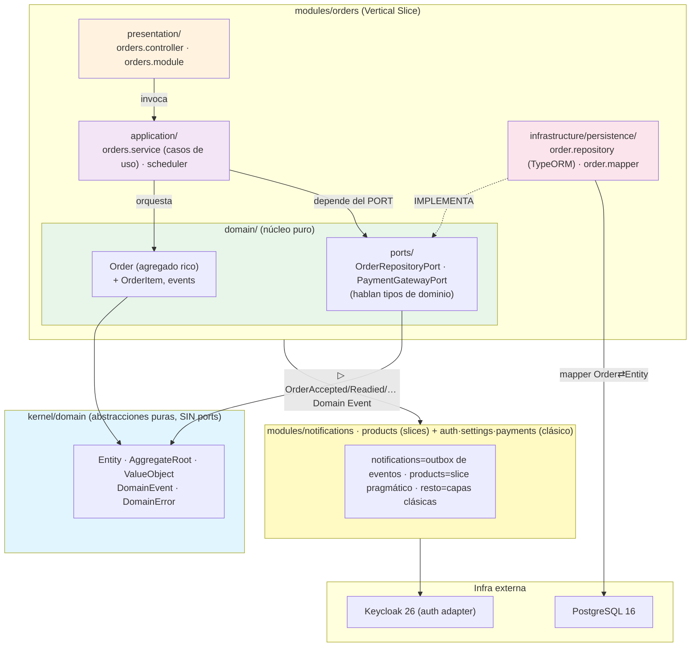
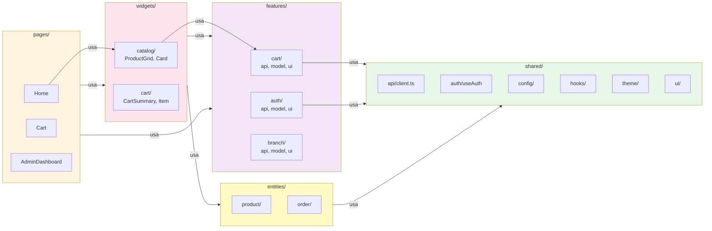

# Architecture Manual — UTC Pick Sazón

**Versión:** 1.0 (migración Hexagonal + DDD + Vertical Slice **COMPLETADA**)  
**Última actualización:** 2026-07-10  
**Objetivo:** Manual de referencia para arquitecto de software, agentes de IA, y revisores de código.  
**Scope:** Backend NestJS + Frontend React Native (Expo) + PostgreSQL + Keycloak.  
**Estado:** migración incremental a Vertical Slice **cerrada** (D-038…D-046). Backend con slices `orders` (DDD táctico completo), `notifications` (outbox + eventos) y `products` (pragmático), + capas clásicas para `auth`/`settings`/`payments`. Verdad viva (gana si contradice): ADRs en `docs/arquitectura/decisiones.md` + `docs/roadmap/PROMPT_CONTEXTO_ARQUITECTURA.md`.

---

## Tabla de Contenidos

1. [Visión Arquitectónica](#1-visión-arquitectónica)
2. [Decisiones Arquitectónicas Clave](#2-decisiones-arquitectónicas-clave)
3. [Estructura del Backend](#3-estructura-del-backend)
4. [Estructura del Frontend](#4-estructura-del-frontend)
5. [Flujos Completos](#5-flujos-completos)
6. [Modelo de Autenticación](#6-modelo-de-autenticación)
7. [Modelo de Datos](#7-modelo-de-datos)
8. [Invariantes Arquitectónicas](#8-invariantes-arquitectónicas)
9. [Límites de Complejidad](#9-límites-de-complejidad)
10. [Puntos de Regresión Críticos](#10-puntos-de-regresión-críticos)
11. [Infraestructura y Deployment](#11-infraestructura-y-deployment)
12. [Diagramas Mermaid](#12-diagramas-mermaid)

---

## 1. Visión Arquitectónica

### 1.1 Propósito del Sistema

**UTC Pick Sazón** es una plataforma de pedidos oscuros ("dark kitchen") para cooperativas universitarias. Estudiantes piden comida desde la app, administradores cocinan y gestionan colas, y el sistema facilita la logística y coordinación.

**Escala de negocio:**
- ~500 estudiantes / período académico
- ~1000 pedidos/día en hora pico (10-15 min de concentración)
- Multi-sucursal (3-5 cooperativas).
- Proyección: 2 meses MVP operativo; 12 meses expansión a otras universidades.

### 1.2 Principios Arquitectónicos

| Principio | Descripción | Implicación |
|-----------|-------------|------------|
| **Hexagonal + Vertical Slice (D-038)** | Código organizado por **módulo de negocio** (`modules/<contexto>/`), no por capa técnica global. El dominio define **puertos** (interfaces); la infraestructura los **implementa** (adapters). | Cambiar Keycloak→AZURE = nuevo adapter, dominio intacto. Cada módulo es un mini-sistema autónomo y copiable. |
| **DDD Híbrido** | Agregados ricos con comportamiento, value objects, reglas explícitas. | Order no es un "DTO pasivo", es una **entidad que valida sus propias reglas**. |
| **Single Responsibility** | Cada módulo tiene una razón para cambiar. | Service orquesta; Aggregate regula; Repository persiste. |
| **Type Safety** | TypeScript + Value Objects (no strings sueltos para BranchId, UserId, etc.). | Evita bugs como "pedir en rama A y que responda rama B". |
| **Testability** | 70%+ cobertura de lógica; tests unitarios de agregados independientes de BD. | Refactor sin miedo. |
| **Auditabilidad** | Domain Events + AuditLogService. Cada cambio importante deja rastro. | Cumplimiento OWASP ASVS L2 V8, trazabilidad para tesis. |

### 1.3 Principios de Evolución

- **Arquitectura objetivo congelada** (D-038): Hexagonal + DDD + Vertical Slice + kernel minimalista. No se re-discute; se ejecuta. Si crees que está mal, se dice UNA vez con argumento (regla 45), no se reabre.
- **Migración INCREMENTAL — CERRADA** (D-040→D-046): se ejecutó módulo a módulo (nunca big-bang; el repo siempre compiló y los tests verdes). Hoy `orders`/`notifications`/`products` son slices; `auth`/`settings`/`payments` se quedaron en capas clásicas **a propósito** (regla 46 — CRUD/cross-cutting que no amerita el molde). El `domain/` viejo con fuga a TypeORM se retiró (D-043): `src/domain/` es hoy solo vocabulario puro (`enums.ts`).
- **Reglas 42-46:** ubicar el código antes de escribir + reutilizar (42), análisis de 6 preguntas ante cambios que cruzan módulos (43), no crear carpetas sin justificar (44), no aceptar patrones por autoridad (45), umbrales YAGNI de estructura (46).
- **Metrics-driven:** si un archivo crece, refactor en esa semana (no dejar tech debt).

---

## 2. Decisiones Arquitectónicas Clave

### 2.1 Hexagonal + DDD + Vertical Slice (D-038)

**Decisión:** un solo stack coherente, cada dimensión resuelta por una arquitectura distinta:

- **Vertical Slice** → *¿cómo organizo el código?* Por **módulo de negocio** (`modules/orders/`, `modules/products/`…), no por capa técnica global. Cada módulo es un mini-sistema autónomo (contracts + domain + application + infrastructure + presentation + tests **juntos**) y copiable a otro proyecto sin arrastrar dependencias.
- **DDD** → *¿dónde vive la lógica de negocio?* En **agregados ricos** (`Order`), value objects, domain events y domain services. NO en services anémicos ni en repos.
- **Hexagonal (Ports & Adapters)** → *¿cómo aíslo la tecnología externa?* El dominio define **puertos** (interfaces); la infraestructura los **implementa** (adapters). Cambiar Keycloak→AZURE = nuevo adapter, dominio intacto (AZURE-ready).

**Piezas congeladas:**

| Pieza | Regla congelada |
|-------|-----------------|
| **kernel minimalista** | Solo abstracciones de dominio PURAS: `Entity`, `AggregateRoot`, `ValueObject`, `DomainEvent`, `DomainError`. **SIN ports.** (`UseCase` se retiró — dead code: el caso de uso es el `service` del slice, no una interfaz genérica.) |
| **Puertos** | En el slice DDD (`orders`) viven en `modules/<x>/domain/ports/` y hablan tipos de **dominio**/contratos (`Order`/`OrderResponse`), nunca `OrderEntity`. En los módulos **pragmáticos/clásicos** (`products`/`settings`/`auth`) el puerto vive en `application/` y habla la **entidad TypeORM** como modelo compartido (excepción entity-as-model, D-043/D-046). |
| **CQRS ligero** | `commands/` y `queries/` son solo carpetas (nacen a ~20 casos). **SIN `CommandBus`/`QueryBus`/`Mediator`** — se llama al caso de uso directo. |
| **contracts** | DTOs públicos **dentro del módulo** (`modules/<x>/contracts/`). Se promueven a `backend/contracts/` SOLO si se genera SDK/OpenAPI público real. |
| **Estrategia de error** | ÚNICA: excepciones de dominio (`DomainError extends Error`, D-039). Los VOs validan en constructor y lanzan `DomainError`; Nest mapea cada subtipo a su HTTP. **`Result`/`Either` ELIMINADOS** del kernel (no se mezclan dos estilos con las excepciones que Nest ya usa). |

La regla mental que lo une todo: **si borro toda la carpeta `infrastructure/` de un módulo, su `domain/` debe seguir compilando.** Todo apunta al dominio; el dominio no apunta a nadie.

**Alternativas rechazadas:**
- **Capas horizontales globales como DEFAULT** (`application/`, `domain/`, `infrastructure/`, `presentation/` para todo): dispersan un caso de negocio en 4 carpetas → rechazadas como default. Se **conservan a propósito** solo para `auth`/`settings`/`payments` (CRUD/cross-cutting que no amerita el molde, regla 46); lo que tiene dominio rico (`orders`) o es bounded context propio (`notifications`, `products`) es Vertical Slice.
- **CQRS completo con Mediator/bus:** overkill; se usa CQRS ligero (solo carpetas).
- **`Result`/`Either`:** descartados (D-039) — una sola estrategia de error.
- **Microservicios:** no justificado (una cooperativa por instancia basta).
- **Entidades anémicas:** conducen a services gordos; la lógica va al agregado.

**Cómo se llegó aquí:** tres rondas de crítica cruzada (Claude ↔ ChatGPT), aterrizadas al contexto real (1 dev, 160h, tesis, AZURE futuro). Ver `docs/roadmap/PROMPT_CONTEXTO_ARQUITECTURA.md` PARTE II y `decisiones.md` D-038.

---

### 2.2 Persistencia: TypeORM + PostgreSQL (D-X)

**Decisión:** TypeORM (ORM tipado) + PostgreSQL 16.

**Justificación:**
- TypeORM integra bien con NestJS (decoradores, migraciones, relaciones).
- PostgreSQL: ACID, JSON, full-text search, escalable a producción.
- `synchronize: false`: migraciones explícitas (no auto-sync en prod, garantiza auditoría).

**Invariantes:**
- Nunca `synchronize: true` en BD compartida.
- Migraciones con down-script documentadas.
- CHECK constraints en BD (p. ej. `stock >= 0` es vinculante, no es solo lógica de app).

---

### 2.3 Autenticación: Keycloak + JWT RS256 (D-014..D-017, D-031, D-036)

**Decisión:** Keycloak local (sin Microsoft/Azure) + JWT RS256 + MFA TOTP en admin.

**Justificación:**
- Local: no depender de IT de UTC.
- RS256: firma del servidor, verificación cliente.
- MFA admin: OWASP ASVS L2 A3.

**Detalles:**
- Realm `utc-food` con dos roles: `user` (estudiante), `admin` (cooperativa).
- Token TTL 30 min; refresh token 7 días.
- Endpoint `POST /auth/refresh` para renovación sin re-login.

---

### 2.4 Geolocalización y Multi-Sucursal (D-035)

**Decisión:** Geolocalización automática (cliente + admin), no precargar sucursal.

**Justificación:**
- Previene "pedir en A, responde B" (problema real encontrado).
- Admin ve su propia cola (sucursal asignada por geo).
- Cliente ve sucursal más cercana auto-asignada.

**Invariante:** Cada pedido tiene `branchId`. Queries de admin filtran por rama automáticamente.

---

### 2.5 Stock como Domain Concept (D-037, en prod)

**Decisión:** Stock son unidades físicas, el ciclo del pedido lo mueve. `0` no bloquea vender (se cocina al momento).

**Justificación:**
- Dark kitchen: no prepara sin orden → puede vender aunque stock=0.
- Excedente: si no se recoge → vuelve a stock (+1) como reoferta.
- Locks pesimistas (FOR UPDATE) en transiciones concurrentes.

---

## 3. Estructura del Backend

### 3.1 Layout de Carpetas (Vertical Slice — objetivo)

Estructura **real hoy** (2026-07-10). Las sub-carpetas marcadas `⌁` aún **no existen**; nacen por umbral (regla 46) cuando el volumen las pida.

```
backend/src/
│
├── kernel/domain/                          # abstracciones de dominio PURAS (una sola vez)
│   ├── Entity.ts                            # identidad por id
│   ├── AggregateRoot.ts                     # raíz + acumula domain events (record/pullEvents)
│   ├── ValueObject.ts                       # base de los Value Objects
│   ├── DomainEvent.ts                       # "algo pasó" (nombre en pasado)
│   └── DomainError.ts                       # ÚNICA estrategia de error (D-039). SIN UseCase, SIN ports.
│
├── modules/                                # VERTICAL SLICE: un módulo = un bounded context
│   │
│   ├── orders/                             # slice DDD táctico COMPLETO
│   │   ├── contracts/                       # DTOs del módulo (create-order, order-response, metrics, update-status)
│   │   ├── domain/                          # NÚCLEO puro (sin Nest, sin TypeORM)
│   │   │   ├── entities/Order.ts            # AGREGADO raíz: transiciones + StockEffect + place() factory
│   │   │   ├── value-objects/               # money.ts · quantity.ts · ids.ts (OrderId/ProductId branded)
│   │   │   ├── events/order-events.ts       # OrderAccepted · OrderReadied · OrderCancelled · OrderNotPickedUp
│   │   │   └── ports/order.repository.port.ts   # PUERTO — habla Order/OrderResponse, nunca OrderEntity
│   │   ├── application/                      # orders.service.ts (casos de uso) · order-expiry.scheduler.ts
│   │   ├── infrastructure/persistence/      # order.repository.ts (adapter TypeORM, lock/tx/stock) · order.mapper.ts
│   │   ├── presentation/                    # orders.controller.ts · orders.module.ts
│   │   └── tests/unit/                       # order.spec · order-place.spec · value-objects.spec
│   │
│   ├── notifications/                      # slice FINO (2º bounded context, D-045)
│   │   ├── domain/                          # notification-type.ts · notification-content.ts (sin agregado)
│   │   ├── application/notifications.service.ts    # lectura del outbox (GET /mine)
│   │   ├── contracts/notification-response.ts
│   │   ├── infrastructure/order-events.handler.ts  # escucha eventos de orders → escribe outbox (en la tx)
│   │   └── presentation/                    # notifications.controller.ts · notifications.module.ts
│   │
│   └── products/                           # slice PRAGMÁTICO (entity-as-model, D-046)
│       ├── domain/product.policy.ts         # invariantes de disponibilidad/reoferta (no agregado rico)
│       ├── application/                      # products.service.ts · product.repository.port.ts (puerto entity-as-model)
│       ├── contracts/                        # create/update-product.dto · product-response · product.constants
│       ├── infrastructure/persistence/typeorm-product.repository.ts
│       └── presentation/                    # products.controller.ts · products.module.ts
│
├── application/                            # CAPAS CLÁSICAS (deliberado, regla 46): CRUD/cross-cutting
│   ├── auth/                                # auth.service.ts + user-profile.repository.port.ts (+ dto/)
│   ├── settings/                            # settings.service.ts + settings.repository.port.ts (+ dto/)
│   └── payments/                            # payment-gateway.service.ts (pasarela simulada + circuit breaker)
│
├── domain/enums.ts                         # vocabulario PURO de los contextos clásicos (infra lo re-exporta)
│
├── infrastructure/                         # entities TypeORM · migrations · repositories (settings/user-profile)
│   ├── auth/jwt.strategy.ts · keycloak/keycloak-admin.service.ts
│   └── database/{entities,migrations,repositories,data-source,database.module}
│
├── presentation/                           # controllers/módulos clásicos: auth/ · settings/ · health/
│
└── shared/                                 # cross-cutting real (mínimo, regla 44/46)
    ├── events/                              # domain-event-dispatcher.ts · events.module.ts (@Global)
    ├── logging/                             # audit-log.service.ts · logging.module.ts (@Global)
    └── resilience/                          # circuit-breaker.ts
```

> `⌁` = nace por umbral, nunca antes. Sub-carpetas aún inexistentes: `orders/domain/services/` (Domain Service — no ha hecho falta), `tests/integration/`+`contract/`, `infrastructure/{external,messaging,cache}/`.

#### Nota — migración CERRADA (D-040→D-046)

La migración incremental **terminó**. El `domain/` viejo con fuga a TypeORM se **retiró** (D-043): sus puertos de repositorio se movieron a `application/<ctx>/*.repository.port.ts` y `src/domain/` quedó solo con `enums.ts` (vocabulario puro). La lógica de negocio de `orders` (transiciones + stock D-037) **ya vive en el agregado `Order`**; el adapter TypeORM solo persiste (lock/tx/SQL de stock). Backend `tsc` 0 + **117 tests** + app arranca. NO queda layout "viejo" pendiente de retirar: lo que sigue en capas clásicas (`auth`/`settings`/`payments`) es **decisión** (regla 46), no deuda.

### 3.2 Capas y Dependencias (fuente: `dependency-rules.md`)

Las capas viven **dentro de cada módulo**, no como raíces globales. Dirección única: **todo apunta al dominio; el dominio no apunta a nadie.** Los adapters de `infrastructure/` **implementan** los puertos del dominio (apuntan HACIA el dominio, nunca al revés).

```
Presentation  ──→  Application  ──→  Domain  ──→  (Ports)
                                                     ▲
Infrastructure ─────────────────────────────────────┘
   (Adapters IMPLEMENTAN los Ports; apuntan HACIA el dominio)
```

**Nivel de CAPA — permitido ✅ / prohibido ✗:**

```
✅ Presentation   → Application            (controller invoca caso de uso)
✅ Application    → Domain / Domain Ports  (orquesta; depende de la INTERFAZ)
✅ Infrastructure → Domain Ports           (adapter IMPLEMENTA la interfaz)
✅ Infrastructure → Domain (tipos)         (el mapper conoce el agregado)
✅ Cualquier capa → kernel/domain          (Entity, DomainError, ValueObject…)

✗ Domain          → Infrastructure         (el dominio NO conoce TypeORM/Keycloak/HTTP)
✗ Domain          → Application / Presentation
✗ Application      → Infrastructure concreto (depende del PORT, no del adapter)
✗ kernel           → cualquier módulo / Infrastructure
```

**Prueba mnemónica:** borra `infrastructure/` de un módulo → su `domain/` sigue compilando. Si no compila, hay una dependencia prohibida.

**Nivel de MÓDULO** (detalle en `bounded-contexts.md`):

```
✅ orders → products / users / settings   (lectura, vía contracts/ del destino)
✅ orders ▷ notifications                  (por Domain Event, NO llamada directa)
✅ (todos) ← auth                           (cross-cutting: JWT/guard, no import de módulo)

✗ products / users / settings / notifications → orders   (nunca de vuelta → evita ciclos)
✗ import directo del domain/ interno de otro módulo
✗ imports circulares entre módulos (BLOQUEADO)
```

Romper un ciclo: **el que SABE publica un evento; el que REACCIONA se suscribe** (`orders` emite `OrderReadied`; `notifications` lo escucha vía el dispatcher). El emisor no conoce al receptor.

---

## 4. Estructura del Frontend

### 4.1 Layout de Carpetas (FSD)

Estructura **real hoy** (FSD v2, sin `processes/`/`flows/` — regla 46). Expo SDK 56.

```
frontend/src/
├── app/navigation/            # RootNavigator · MainStack/MainTabs · AdminStack/AdminTabs · FloatingTabBar · types
│                              #  (App.tsx real está en la raíz frontend/, no en src/app/)
│
├── entities/                  # modelos de negocio (tipos + api + datos canónicos)
│   ├── product/               # model/types · api.ts (GET /products) · admin-api.ts · admin-types.ts · icons.tsx · images.ts
│   ├── order/                 # model/types · api.ts · admin-types.ts · schedule.ts
│   └── branch/                # model/types · branches.ts (lista canónica, sin backend — D-041)
│
├── features/                  # acciones del usuario (stores Zustand + api/lib/ui colocados)
│   ├── admin/model/           # catalog.store · settings.store
│   ├── auth/                  # api/auth.api · model/session.store
│   ├── branch/                # lib/useBranchLocation · model/branch.store
│   ├── cart/model/            # cart.store
│   ├── catalog/model/         # catalog.store (cliente; usa createCatalogLoader → backend única fuente)
│   ├── notifications/model/   # messages · useOrderNotifications (polling+diff local) · useScheduledAlerts
│   ├── orders/model/          # orders.store
│   ├── profile/model/         # settings.store
│   └── wallet/                # model/wallet.store · ui/CardForm
│
├── pages/                     # pantallas
│   ├── admin/                 # account/{AdminAccount,Personalizacion} · dashboard · menu/{Menu,ProductEdit,Reoffer} · order-detail · queue
│   ├── auth/{LoginUsuario,LoginAdmin} · cart · home · orders · product · profile · tracking · wallet · welcome
│
├── widgets/                   # bloques compuestos: auth/AuthScaffold · branch/BranchPicker
│
└── shared/                    # reutilizable, no sube de capa
    ├── api/client.ts          # HTTP client (fetch + refresh de token)
    ├── lib/                   # card.ts · catalog-loader.ts · geo.ts
    ├── notifications/notify.ts
    ├── theme/                 # index.ts · tokens.ts
    ├── ui/                    # Badge · Chip · PrimaryButton · QtyStepper · Type · CoffeeLoader · OrderTracker · Media · Logo* · BrandField
    └── a11y/a11y.store.ts
```

> Los datos mock (`PRODUCTS`/`ADMIN_ORDERS`) se **eliminaron** (D-046): el runtime usa la API real; no hay red de mock. Los `*-types.ts` de `entities/` son vocabulario real (tipos + constantes de display), no datos falsos.

### 4.2 Invariantes Frontend

- **`shared/` NUNCA importa de `features/`** (dirección de dependencia).
- **`features/[feature]` puede importar de `entities/`, `shared/`** pero no de otra feature (desacoplamiento).
- **Stores (Zustand) en `features/[feature]/model/`** (no un store global monolítico).
- **API calls en `features/[feature]/api/` o `entities/[entity]/api/`** (colocadas).

---

## 5. Flujos Completos

### 5.1 Flujo: Cliente Crea Pedido

**Secuencia:**
```
React Native Client
  ↓
1. Usuario en Home toca "Agregar al carrito" (ProductCard)
   → CartStore.addItem(productId, qty)

2. Usuario toca "Ir a checkout" (CheckoutButton)
   → navega a CartScreen

3. CartScreen valida:
   - ¿Hay sucursal asignada? (si no, error)
   - ¿Hay items en carrito? (si no, error)
   - ¿Hay método de pago seleccionado? (si no, error)

4. Usuario toca "Confirmar pedido"
   → POST /orders/create
      Headers: { Authorization: Bearer <JWT> }
      Body: { items: [...], payMethod, branchId, scheduledFor }
   
NestJS Backend (Application Layer)
  ↓
5. OrdersService.createOrder(dto, user)
   - Valida JWT (guard)
   - Valida rol = 'user' (roles guard)
   - Carga UserProfile desde BD (authService)
   - Carga Products desde BD
   
   Delega a Order.place(...)  (factory de dominio)
   
   → Order.place valida y calcula (dominio puro):
     - Todos los ítems existen y están disponibles
     - Congela el precio (reoffer si aplica) → subtotales + total (Money VO)
     - Valida la hora programada (≥30 min, mismo día America/Mexico_City)
   
   → Persistencia (tx corta; el pago ya se autorizó ANTES de abrir la tx):
     - OrderEntity + OrderItemEntity + Payment guardados (status PENDING)
     - Stock NO se toca al crear — se RESERVA al aceptar (PENDING→PREPARING, D-037)
     - Sin domain event en creación (BR-012 avisa en accept/ready/cancel/not-picked-up)

6. Response: 201 Created
   Body: { orderId: "abc-123", orderNumber: "U-00001", ... }

React Native Client
  ↓
7. Cliente recibe respuesta
   → SessionStore.setLastOrder(orderNumber)
   → Navigate a TrackingScreen
   → Mostrar código de recogida "U-00001"

```

**Puntos de regresión:** Stock descuenta, usuario puede ver su propio pedido, no ve otros.

---

### 5.2 Flujo: Admin Marca Pedido Listo

**Secuencia:**
```
React Native Admin (AdminStack)
  ↓
1. AdminDashboard muestra cola (órdenes en PENDING + PREPARING)
   GET /orders/all?branchId=<adminBranchId>
   - Guard: rol = 'admin'
   - Filtro automático por sucursal (geo-asignada)

2. Admin toca "Marcar listo" en una orden
   → PATCH /orders/{id}/status
      Body: { status: "ready" }
   
NestJS Backend
  ↓
3. OrdersService.updateStatus(id, "ready", user)
   - Valida JWT + rol admin
   - Carga Order (con lock FOR UPDATE, D-037)
   - Delega a Order.transitionTo(READY)
   
   → Order valida:
     - Estado actual = PREPARING
     - Transición a READY permitida
   
   → Efectos:
     - pickupDeadline = now + 20 min (D-005)
     - Prep times registrados (últimas 20 muestras, D-037)
     - Stock NO cambia (ya fue reservado al aceptar)
     - Event OrderReadied emitido (record → pullEvents → outbox en la tx)
     - AuditLog generado

4. Response: 200 OK
   Body: { orderId, status: "ready", pickupDeadline, ... }

React Native Client (polling)
  ↓
5. TrackingScreen hace poll cada ~15s
   GET /orders/{orderId}
   
   → Recibe status: READY
   → Muestra notificación local: "Tu pedido está listo"
   → UI cambia a color verde, botón "Recoger"

```

**Puntos de regresión:** Solo admin puede marcar listo, deadlines se calculan, no se doble-marcan.

---

### 5.3 Flujo: Autenticación + Refresh

**Secuencia:**
```
React Native Client
  ↓
1. Usuario en LoginScreen entra con @edu.utc.mx
   POST /auth/login
   Body: { email: "ana@edu.utc.mx", password: "..." }

NestJS Backend (Auth Module)
  ↓
2. AuthService.login(email, password)
   → Keycloak directAccessGrant (grant_type=password)
   → Keycloak valida credenciales
   → Retorna { access_token, refresh_token, expires_in: 1800 }
   → AuditLog: "Login exitoso: ana@edu.utc.mx"

3. Response: 200 OK
   Body: { accessToken, refreshToken, expiresIn }

React Native Client
  ↓
4. SessionStore.setSession({
       accessToken,
       refreshToken,
       userId: jwtDecode(accessToken).sub,
       email,
       roles
     })
   → Guardar en encrypted storage

5. Cada request posterior:
   Authorization: Bearer <accessToken>

6. Access token expira en 30 min
   → Próximo request: 401 Unauthorized
   
   → Client detecta 401 + tiene refreshToken
   → POST /auth/refresh
      Body: { refreshToken }
   
NestJS Backend
  ↓
7. AuthService.refresh(refreshToken)
   → Keycloak grant_type=refresh_token
   → Retorna nuevo access_token + nuevo refresh_token
   
8. Response: 200 OK
   Body: { accessToken, refreshToken }

React Native Client
  ↓
9. SessionStore.setSession({ ...nuevos tokens })
   → Reintenta request original con nuevo token
   → Success

```

**Puntos de regresión:** Tokens no invalidan sesiones concurrentes, refresh no requiere MFA nuevamente.

---

### 5.4 Flujo: Pagos Simulados (C2 + C4, D-033)

**Secuencia:**
```
React Native Client (Checkout)
  ↓
1. Usuario selecciona método:
   - Efectivo (sin tarjeta)
   - Tarjeta crédito/débito
   - Mercado Pago
   - PayPal

2. Si es tarjeta:
   - Abre CardForm modal
   - Usuario ingresa: número, titular, expira, CVV
   - Validación relajada: 13-19 dígitos (no Luhn)
   
   → POST /payments/authorize
      Body: { amount, cardData }

NestJS Backend (Payment Gateway, D-033)
  ↓
3. PaymentGatewayService.authorize(amount)
   → Envuelto en CircuitBreaker (D-020)
   
   → Si circuit CLOSED:
      - Llamada a simulador de pasarela
      - Random: 90% aprobado, 10% rechazado
      - Log en AuditLog (cifrar CVV)
   
   → Si circuit OPEN:
      - Rechazar con "Pasarela no disponible"
      - Sugerir efectivo
   
4. Response: 200 OK
   Body: { status: "PAID", transactionId, ... }

React Native Client
  ↓
5. SessionStore.setPaymentAuthorized(true)
   → Habilitar botón "Confirmar pedido"

6. POST /orders/create
   Body: { items, payMethod: "tdc", cardLastFour: "4242", ... }

NestJS Backend
  ↓
7. OrdersService.createOrder(...)
   → Order creado con payStatus: PAID (tarjeta) o PENDING (efectivo)
   → AuditLog: "Pago simulado autorizado para U-00001"

```

**Puntos de regresión:** Efectivo solo cobra al recoger, tarjeta marca como cobrado ya, circuit breaker rechaza si está abierto.

---

## 6. Modelo de Autenticación

### 6.1 Keycloak Setup (Local)

**Realm:** `utc-food`

**Clientes:**
- `mobile-app` (public, dirección grant)
- `backend-svc` (confidential, service account)

**Roles:**
- `user` (estudiante)
- `admin` (administrador de cooperativa)

**Usuarios sembrados:**
- `coop-admin` / `admin@picksazon.app` → rol `admin`, MFA TOTP requerido
- Estudiantes se auto-registran con `@edu.utc.mx`

### 6.2 Flujo JWT

1. **Login:** directAccessGrant (password) → Keycloak emite JWT RS256 (30 min) + refresh (7 días).
2. **Validación:** NestJS JwtStrategy valida firma contra JWKS endpoint.
3. **Roles:** RolesGuard extrae `realm_access.roles` del JWT.
4. **Refresh:** `POST /auth/refresh` con refresh_token → nuevo access_token sin re-login.

### 6.3 MFA Admin

- **Requerida:** Rol `admin` tiene `requiredActions: ['CONFIGURE_TOTP']`.
- **Enrolamiento:** Out-of-band (Account Console del navegador), no desde app.
- **OTP:** TOTP (Google Authenticator), 6 dígitos, 30s.
- **Política:** Condicional (Direct Grant con password + OTP).

### 6.4 Guardrails

- **`@Public()`:** endpoint sin JWT (ej: `/auth/login`, `/auth/register`).
- **`@Roles('admin')`:** solo admin (ej: `PATCH /orders/{id}/status`).
- **`@Roles('user')`:** solo estudiante (ej: `GET /orders/mine`).
- **BR-014:** Usuario solo puede ver sus propios pedidos.

---

## 7. Modelo de Datos

### 7.1 Principales Entidades

#### Order (Agregado)
- `id`: UUID PK
- `orderNumber`: U-00001 (secuencial)
- `userId`: FK UserProfile (BR-014: propiedad)
- `branchId`: FK Branch (D-035: geolocalización)
- `status`: enum (PENDING, PREPARING, READY, READY_LATER, PICKED_UP, NOT_PICKED_UP, CANCELLED)
- `totalAmount`: numeric(10,2) (snapshop de precios)
- `paymentMethod`: enum (MERCADO_PAGO, PAYPAL, TDC, TDD, EFECTIVO)
- `paymentStatus`: enum (PENDING, PAID, FAILED, REFUNDED)
- `createdAt`: timestamptz (BR-005: hora servidor)
- `acceptedAt`: timestamptz (cuando admin marca PREPARING)
- `readyAt`: timestamptz (cuando admin marca READY)
- `pickedUpAt`: timestamptz (cuando cliente recoge)
- `pickupDeadline`: timestamptz (readyAt + 20 min, D-005)
- `scheduledFor`: timestamptz nullable (pedido programado, spec #4)

**Invariantes:**
- `totalAmount > 0`
- `status` solo transiciona per ALLOWED_TRANSITIONS
- `pickupDeadline > readyAt` (si existe)
- `stock >= 0` (CHECK constraint)

#### OrderItem (Value Object dentro Order)
- `id`: UUID PK
- `orderId`: FK Order
- `productId`: FK Product
- `quantity`: int > 0
- `unitPrice`: numeric (snapshop, BR-015)
- `subtotal`: computed

#### Product (Agregado)
- `id`: UUID PK
- `name`: text
- `description`: text nullable
- `price`: numeric(10,2) > 0 (CHECK)
- `basePrepTimeSeconds`: int > 0 (CHECK)
- `stock`: int >= 0 (CHECK)
- `minStock`: int >= 0
- `maxStock`: int nullable (si exists, >= minStock)
- `category`: text
- `imageUrl`: text nullable
- `status`: enum (POR_PREPARAR, PREPARADO, SIN_TIEMPO_ESPERA, CALENTANDO, NO_DISPONIBLE)
- `isAvailable`: bool (candado de venta, no es el stock)
- `reofferPrice`: numeric nullable > 0 (descuento para excedente)

**Invariantes:**
- `price > 0`, `basePrepTimeSeconds > 0`, `stock >= 0`
- `maxStock >= minStock` (si ambas existen)

#### UserProfile
- `id`: UUID PK
- `keycloakId`: text unique (keycloak sub)
- `email`: text unique
- `firstName`, `lastName`: text
- `role`: enum (USER, ADMIN)
- `branchId`: FK Branch (D-035: geo-asignada)
- `createdAt`: timestamptz

#### Branch
- `id`: UUID PK
- `name`: text
- `location`: point (lat/lon para geo)
- `operatingHours`: jsonb ({ dayOfWeek, open, close })
- `cooperativeName`: text

#### AppSettings (Singleton)
- `id`: PK = 1
- `congestionYellow`: int = 5
- `congestionRed`: int = 10
- `refOfferMinutes`: int = 5

#### AuditLog (OWASP V8)
- `id`: UUID PK
- `userId`: FK UserProfile nullable
- `action`: text (ej: "LOGIN_SUCCESS", "ORDER_ACCEPTED")
- `resource`: text (ej: "orders", "auth")
- `resourceId`: text nullable
- `details`: jsonb (contexto, sin secrets)
- `createdAt`: timestamptz

#### PreparationTime (J5)
- `id`: UUID PK
- `productId`: FK Product
- `durationSeconds`: int
- `recordedAt`: timestamptz

### 7.2 Relaciones y Restricciones

```mermaid
erDiagram
    ORDER ||--o{ ORDER_ITEM : "contains"
    ORDER_ITEM }o--|| PRODUCT : "references"
    ORDER }o--|| USER_PROFILE : "created by"
    ORDER }o--|| BRANCH : "for"
    USER_PROFILE }o--|| BRANCH : "assigned to"
    PRODUCT }o--|| BRANCH : "in" (multi-sucursal)
    APP_SETTINGS ||--|| BRANCH : "1:N override"
```

---

## 8. Invariantes Arquitectónicas

### 8.1 Por Capa (dentro del módulo)

| Capa | Invariante | Verificación |
|------|-----------|------------|
| **domain/** (del módulo) | NUNCA importa Nest, TypeORM, HTTP, ni otra capa (application/infrastructure/presentation) | `grep -rE "@nestjs\|typeorm" src/modules/*/domain/` → debe estar vacío; borra `infrastructure/` → `domain/` compila |
| **domain/ports/** | Los puertos hablan tipos de DOMINIO (`Order`), nunca `OrderEntity` | Firma del port referencia el agregado, no la entity TypeORM |
| **application/** | Orquesta; depende del PORT (interfaz), no del adapter concreto. NUNCA SQL directo | `grep -rE "SELECT\|INSERT\|UPDATE" src/modules/*/application/` → vacío |
| **infrastructure/persistence/** | El `mapper` es el ÚNICO que conoce ambos mundos (Order ⇄ OrderEntity) | Tests de mapper |
| **presentation/** | NUNCA lógica de negocio (solo orquestación HTTP + cableado del port por símbolo) | Controllers < 200 LOC |
| **kernel/domain/** | Solo abstracciones puras; SIN ports, sin dependencia a ningún módulo | `grep -rE "modules/\|typeorm" src/kernel/` → vacío |
| **shared/** (frontend) | NUNCA importa de features/ | `grep -r "^import.*features" src/shared/` → vacío |

### 8.2 Por Patrón

| Patrón | Regla | Excepción |
|--------|-------|-----------|
| **Agregados** | Rico, no anémico: la invariante vive en el agregado (`Order.cancelByOwner()`), no en el service. Un `Order` = una transacción DB | Cambios cruzados = múltiples tx vía Domain Event, no un mega-agregado |
| **Value Objects** | Inmutables, sin identidad; validan en constructor y lanzan `DomainError` | Factory methods (`Money.of(...)`) permitidos |
| **Ports** | Viven en `modules/<x>/domain/ports/`; hablan tipos de dominio; se cablean en Nest por símbolo (`{ provide: ORDER_REPOSITORY_PORT, useClass }`) | — |
| **Errores** | ÚNICA estrategia: `DomainError` (D-039). Subtipos (`OrderNotFoundError`) que la presentación mapea a HTTP | Prohibido `Result`/`Either` |
| **Events** | "Algo pasó" (nombre en pasado); `record()` en el agregado, `pullEvents()` tras persistir | Sin side effects durante construcción |
| **CQRS** | `commands/`/`queries/` son solo carpetas (a ~20 casos). SIN `CommandBus`/`QueryBus`/`Mediator` | — |
| **Locks** | FOR UPDATE en transiciones concurrentes (D-037) | Solo en raíz de agregado (no en items) |

---

## 9. Límites de Complejidad

### 9.1 Líneas de Código por Módulo

Métrica: líneas de código ejecutable (excluyendo tests, comentarios).

| Tipo | Objetivo | Alerta (🟡) | Crítico (🔴) | Acción |
|------|----------|---------|-----------|--------|
| **Agregado** (Order.ts) | 150 | 250 | 400 | Extraer Domain Service |
| **Value Object** | 50 | 100 | 150 | Demasiada lógica, es un agregado |
| **Application Service** | 150 | 300 | 500 | Simplificar orquestación |
| **Repository impl.** | 250 | 350 | 500 | Extraer helpers de mapper |
| **Controller** | 80 | 150 | 200 | Delegar al service |
| **Domain Service** | 150 | 250 | 350 | Revisar responsabilidad |
| **React Component** | 150 | 250 | 350 | Refactor a subcomponentes |
| **Custom Hook** | 100 | 150 | 250 | Lógica de negocio → store |
| **Zustand Store** | 200 | 300 | 400 | Dividir en múltiples stores |

### 9.2 Métrica Semanal

Cada lunes:
```bash
# Backend
find backend/src -name "*.ts" ! -name "*.spec.ts" | xargs wc -l | sort -n | tail -20

# Frontend
find frontend/src -name "*.tsx" ! -name "*.spec.tsx" | xargs wc -l | sort -n | tail -20
```

**Escalada:** Si un archivo suma ese semana 50+ líneas, refactor en esa semana (antes de fin de sprint).

---

## 10. Puntos de Regresión Críticos

### 10.1 Stock y Reservas (D-037)

**Riesgo:** Doble-reserva (dos aceptaciones simultáneas) → inventario inflado.

**Mecanismo de protección:**
- FOR UPDATE (pessimistic_write) en order-row.
- Orden global de locks en product-row (by productId).

**Test obligatorio:**
```typescript
it('dos aceptaciones concurrentes del mismo pedido no doble-descuentan', async () => {
  // Spawn dos updateStatus(PREPARING) casi simultáneamente
  // Verificar que stock se descuenta UNA sola vez
});
```

---

### 10.2 Propiedad de Orden (BR-014)

**Riesgo:** Cliente A ve/modifica orden de cliente B.

**Mecanismo:**
- Guard: `JwtUser` extraído de JWT.
- Query: `where: { id, user: { id: profileId } }`.

**Test obligatorio:**
```typescript
it('cliente A no puede ver orden de cliente B', async () => {
  const orderB = await createOrder(userB, ...);
  const result = await getOrder(orderB.id, userA); // debe fallar
  expect(result).toBeInstanceOf(NotFoundException);
});
```

---

### 10.3 Transiciones de Estado (BR-004)

**Riesgo:** PICKED_UP → PREPARING (revivir orden).

**Mecanismo:**
- `ALLOWED_TRANSITIONS[PICKED_UP] = []` (terminal).
- `OrderPolicy.canTransitionTo()` valida.

**Test obligatorio:**
```typescript
it('no permite transiciones inválidas', async () => {
  const order = Order.create({ status: PICKED_UP, ... });
  expect(() => order.canTransitionTo(PREPARING)).toThrow();
});
```

---

### 10.4 Geolocalización y Sucursal (D-035)

**Riesgo:** Pedir en rama A, responde rama B.

**Mecanismo:**
- Cliente geo-asignado automáticamente (no precargar).
- Admin ve cola filtrada por su rama (geo-asignada).
- Cada pedido tiene `branchId`.

**Test obligatorio:**
```typescript
it('admin ve solo pedidos de su rama', async () => {
  const ordersA = await getAllOrders(adminA); // debe tener branchId=A
  const ordersB = await getAllOrders(adminB); // debe tener branchId=B
  expect(ordersA.every(o => o.branchId === A)).toBe(true);
});
```

---

### 10.5 Token Refresh (D-036)

**Riesgo:** Token expira (5 min) → acción del admin falla con 401 indefinidamente.

**Mecanismo:**
- `POST /auth/refresh` renueva tokens.
- Client interceptor detecta 401 → refresh → reintenta.

**Test obligatorio:**
```typescript
it('cliente renueva token al 401 y reintenta', async () => {
  const oldToken = getToken();
  // Esperar a que expire
  const actionResult = await admin.acceptOrder(...); // debería fallar y repararse
  expect(actionResult).toBeDefined();
  expect(getToken()).not.toBe(oldToken);
});
```

---

### 10.6 Payload Limitado (Rate Limiting + Throttle)

**Riesgo:** DDoS o abuso de API.

**Mecanismo:**
- Global throttler (por IP).
- `/auth/login`: max 5 intentos / 15 min.
- `/auth/refresh`: max 30 intentos / min.

**Test obligatorio:** (Integración con test framework de rate-limit)

---

## 11. Infraestructura y Deployment

### 11.1 Stack Local (Dev)

**docker-compose.yml:**
- `postgres:16` → UTC_PROJECT_DB
- `keycloak:26` → keycloak (realm sync con JSON)
- Backend NestJS (watch mode)
- Frontend Expo (tunnel)

**Puertos (este equipo):**
- Backend: **3002** (D-034, cambio de 3001 — otro proyecto lo usa)
- Keycloak: 8082 (Admin Console)
- Postgres: 5433 (no 5432 — doxia lo usa)
- Frontend: 8081 (Expo Web), tunnel automático

### 11.2 Stack Producción (Futuro)

**Placeholder (no implementado en MVP):**
- Cloud PostgreSQL (AWS RDS / Azure Postgres)
- Keycloak managed (Auth0 / Okta)
- NestJS en container (Docker)
- React Native build: EAS Build (APK/IPA)
- CI/CD: GitHub Actions

### 11.3 Migrations y Seeders

**Migrations:**
- TypeORM migrations en `infrastructure/database/migrations/`
- Correr manual antes de deploy: `npm run migration:run`
- Nunca `synchronize: true` en prod.

**Seeders:**
- `seed-admin.sh` → crea `coop-admin` en Keycloak.
- `seed-demo.sql` → carga datos demo (productos, sucursales).

---

## 12. Diagramas Mermaid

### 12.1 Diagrama de Componentes (Backend)

Vertical Slice: cada módulo agrupa sus capas; el `kernel` da las abstracciones base; los adapters implementan los puertos del dominio del módulo.



### 12.2 Diagrama de Flujo: Crear Pedido


### 12.3 Diagrama de Dependencias (Frontend FSD)



---

## Próximas Secciones (Por Completar)

- [ ] **Sección 5.5:** Flujo completar (Reoferta, Cancelación, Metrics admin)
- [ ] **Sección 6.2:** Diagrama de secuencia Keycloak + MFA
- [ ] **Sección 7.3:** Ejemplos de queries complejas y optimizaciones
- [ ] **Sección 10.7-10.10:** Más puntos de regresión (concurrencia, pagos, notificaciones)
- [ ] **Sección 12.4-12.6:** Diagramas Entity-Relationship, Deployment, Timeline
- [ ] **Apéndice A:** Checklist de Code Review por capa (dependency-rules)
- [ ] **Apéndice B:** Troubleshooting común (stock negativo, 401 infinito, etc.)

### Mapas de gobierno (verdad viva — este manual es el índice, ellos ganan si contradicen)

- `docs/roadmap/PROMPT_CONTEXTO_ARQUITECTURA.md` — contexto maestro de arquitectura (el molde completo).
- `docs/arquitectura/decisiones.md` — ADRs (D-037…**D-046**; migración a slices cerrada).
- `docs/arquitectura/bounded-contexts.md` — Bounded Context Map + Context Map (quién habla con quién).
- `docs/arquitectura/dependency-rules.md` — reglas de dependencia por capa y por módulo (el más consultado).
- `docs/arquitectura/decision-matrix.md` — cuándo crear Aggregate/VO/Service/Módulo/Event/Adapter.
- **Molde en código:** `backend/src/kernel/` + `backend/src/modules/orders/`.

---

**Mantenimiento:** migración a Vertical Slice CERRADA (D-038…D-046). Actualizar este manual ante cambios de arquitectura o al abrir nuevos frentes (p. ej. panel admin, OWASP L2).  
**Propiedad:** Arquitecto del sistema + Lead Developer.  
**Revisiones:** Cada 2 semanas con el equipo completo.
