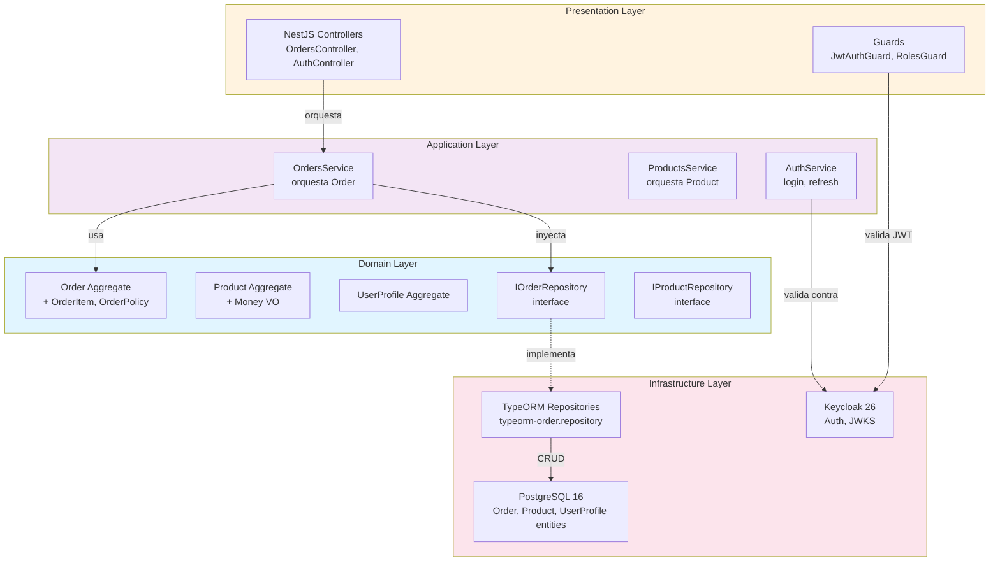
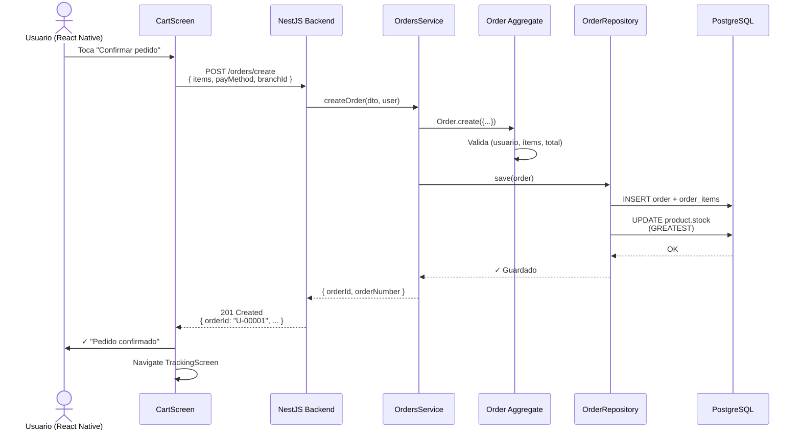
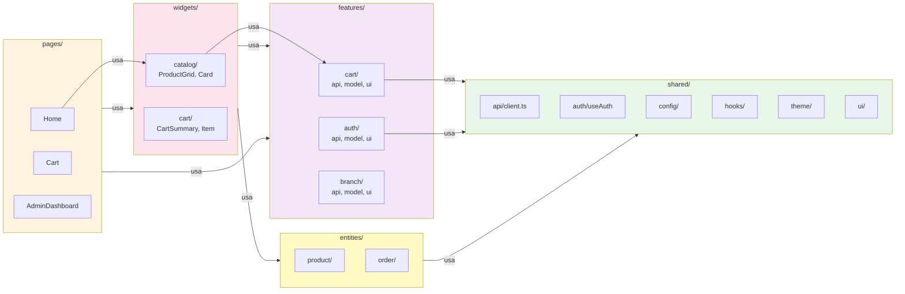

# Architecture Manual — UTC Pick Sazón

**Versión:** 0.1 (Estructura + Fase 0-1)  
**Última actualización:** 2026-07-07  
**Objetivo:** Manual de referencia para arquitecto de software, agentes de IA, y revisores de código.  
**Scope:** Backend NestJS + Frontend React Native (Expo) + PostgreSQL + Keycloak.  
**Próximas actualizaciones:** Conforme progresa refactorización DDD (D-045, semanas 1-4).

---

## Tabla de Contenidos

1. [Visión Arquitectónica](#1-visión-arquitectónica)
2. [Decisiones Arquitectónicas Clave](#2-decisiones-arquitectónicas-clave)
3. [Estructura del Backend](#3-estructura-del-backend)
4. [Estructura del Frontend](#4-estructura-del-frontend)
5. [Flujos Completos](#5-flujos-completos)
6. [Modelo de Autenticación](#6-modelo-de-autenticación)
7. [Modelo de Datos](#7-modelo-de-datos)
8. [Invariantes Arquitectónicas](#8-invariantes-arquitectónicas)
9. [Límites de Complejidad](#9-límites-de-complejidad)
10. [Puntos de Regresión Críticos](#10-puntos-de-regresión-críticos)
11. [Infraestructura y Deployment](#11-infraestructura-y-deployment)
12. [Diagramas Mermaid](#12-diagramas-mermaid)

---

## 1. Visión Arquitectónica

### 1.1 Propósito del Sistema

**UTC Pick Sazón** es una plataforma de pedidos oscuros ("dark kitchen") para cooperativas universitarias. Estudiantes piden comida desde la app, administradores cocinan y gestionan colas, y el sistema facilita la logística y coordinación.

**Escala de negocio:**
- ~500 estudiantes / período académico
- ~1000 pedidos/día en hora pico (10-15 min de concentración)
- Multi-sucursal (3-5 cooperativas).
- Proyección: 2 meses MVP operativo; 12 meses expansión a otras universidades.

### 1.2 Principios Arquitectónicos

| Principio | Descripción | Implicación |
|-----------|-------------|------------|
| **Clean Architecture** | Capas desacopladas: domain → application → infrastructure → presentation | Lógica de negocio aislada de detalles técnicos (BD, HTTP, Keycloak). |
| **DDD Híbrido** | Agregados ricos con comportamiento, value objects, reglas explícitas. | Order no es un "DTO pasivo", es una **entidad que valida sus propias reglas**. |
| **Single Responsibility** | Cada módulo tiene una razón para cambiar. | Service orquesta; Aggregate regula; Repository persiste. |
| **Type Safety** | TypeScript + Value Objects (no strings sueltos para BranchId, UserId, etc.). | Evita bugs como "pedir en rama A y que responda rama B". |
| **Testability** | 70%+ cobertura de lógica; tests unitarios de agregados independientes de BD. | Refactor sin miedo. |
| **Auditabilidad** | Domain Events + AuditLogService. Cada cambio importante deja rastro. | Cumplimiento OWASP ASVS L2 V8, trazabilidad para tesis. |

### 1.3 Principios de Evolución

- **Arquitectura congelada 2 meses** (D-044): hasta MVP operativo, no cambios estructurales.
- **Reglas 42-43** (D-042, D-043): YAGNI (no anticipar), reutilizar antes de crear.
- **Metrics-driven:** si un archivo crece, refactor en esa semana (no dejar tech debt).

---

## 2. Decisiones Arquitectónicas Clave

### 2.1 Clean Architecture + DDD (D-045, en progreso)

**Decisión:** Clean Architecture (capas: domain ← application ← infrastructure ← presentation) + DDD (agregados ricos, value objects, eventos).

**Justificación:**
- Clean es **escalable y mantenible** (cada capa tiene responsabilidad clara).
- DDD es **expresivo** (código refleja las reglas del negocio).
- Juntos: **Clean estructura**, DDD semántica.

**Alternativas rechazadas:**
- CQRS completo (commands/queries separadas): overkill para 2 meses. Revisitar en Fase 3.
- Microservicios: no justificado aún (una cooperativa por instancia es suficiente).
- Entidades anémicas: conducen a servicios gordos y difíciles de entender.

**Validación:** Feedback ChatGPT "9.5/10 para startup en crecimiento"; refactorización en curso.

---

### 2.2 Persistencia: TypeORM + PostgreSQL (D-X)

**Decisión:** TypeORM (ORM tipado) + PostgreSQL 16.

**Justificación:**
- TypeORM integra bien con NestJS (decoradores, migraciones, relaciones).
- PostgreSQL: ACID, JSON, full-text search, escalable a producción.
- `synchronize: false`: migraciones explícitas (no auto-sync en prod, garantiza auditoría).

**Invariantes:**
- Nunca `synchronize: true` en BD compartida.
- Migraciones con down-script documentadas.
- CHECK constraints en BD (p. ej. `stock >= 0` es vinculante, no es solo lógica de app).

---

### 2.3 Autenticación: Keycloak + JWT RS256 (D-014..D-017, D-031, D-036)

**Decisión:** Keycloak local (sin Microsoft/Azure) + JWT RS256 + MFA TOTP en admin.

**Justificación:**
- Local: no depender de IT de UTC.
- RS256: firma del servidor, verificación cliente.
- MFA admin: OWASP ASVS L2 A3.

**Detalles:**
- Realm `utc-food` con dos roles: `user` (estudiante), `admin` (cooperativa).
- Token TTL 30 min; refresh token 7 días.
- Endpoint `POST /auth/refresh` para renovación sin re-login.

---

### 2.4 Geolocalización y Multi-Sucursal (D-035)

**Decisión:** Geolocalización automática (cliente + admin), no precargar sucursal.

**Justificación:**
- Previene "pedir en A, responde B" (problema real encontrado).
- Admin ve su propia cola (sucursal asignada por geo).
- Cliente ve sucursal más cercana auto-asignada.

**Invariante:** Cada pedido tiene `branchId`. Queries de admin filtran por rama automáticamente.

---

### 2.5 Stock como Domain Concept (D-037, en prod)

**Decisión:** Stock son unidades físicas, el ciclo del pedido lo mueve. `0` no bloquea vender (se cocina al momento).

**Justificación:**
- Dark kitchen: no prepara sin orden → puede vender aunque stock=0.
- Excedente: si no se recoge → vuelve a stock (+1) como reoferta.
- Locks pesimistas (FOR UPDATE) en transiciones concurrentes.

---

## 3. Estructura del Backend

### 3.1 Layout de Carpetas

```
backend/
├── src/
│   ├── domain/                          # Lógica de negocio pura
│   │   ├── order/
│   │   │   ├── Order.ts                 # Agregado raíz (en progreso)
│   │   │   ├── OrderItem.ts             # Value object dentro Order
│   │   │   ├── OrderNumber.ts           # Value object: U-00001 format
│   │   │   ├── OrderStatus.ts           # Enum + helpers
│   │   │   ├── OrderPolicy.ts           # Reglas: transiciones válidas
│   │   │   ├── DomainEvents/
│   │   │   │   ├── OrderCreated.ts
│   │   │   │   ├── OrderAccepted.ts
│   │   │   │   └── ...
│   │   │   └── order.repository.ts      # Interfaz (contrato)
│   │   ├── product/
│   │   │   ├── Product.ts               # Agregado raíz (en progreso)
│   │   │   ├── Money.ts                 # Value object: precio
│   │   │   ├── PreparedStock.ts         # Value object: stock con invariantes
│   │   │   ├── ProductStatus.ts
│   │   │   └── product.repository.ts
│   │   ├── settings/
│   │   │   ├── AppSettings.ts           # Agregado: thresholds, horarios
│   │   │   └── settings.repository.ts
│   │   ├── user-profile/
│   │   │   ├── UserProfile.ts           # Agregado: usuario + rol + sucursal
│   │   │   └── user-profile.repository.ts
│   │   └── shared/                      # Value objects compartidos
│   │       ├── BranchId.ts              # Type-safe branch ID
│   │       ├── UserId.ts                # Keycloak sub
│   │       ├── OrderNumber.ts
│   │       ├── Money.ts
│   │       ├── TimeRange.ts
│   │       └── Coordinates.ts           # Lat/lon geolocalización
│   │
│   ├── application/                     # Casos de uso + orquestación
│   │   ├── orders/
│   │   │   ├── orders.service.ts        # Orquesta Order aggregate + repo
│   │   │   ├── dto/
│   │   │   │   ├── create-order.dto.ts
│   │   │   │   ├── order-response.ts
│   │   │   │   └── ...
│   │   │   ├── orders.service.spec.ts
│   │   │   └── ...
│   │   ├── products/
│   │   │   ├── products.service.ts
│   │   │   ├── dto/
│   │   │   └── ...
│   │   ├── settings/
│   │   ├── auth/
│   │   │   ├── auth.service.ts          # Login, refresh, MFA
│   │   │   └── ...
│   │   └── payments/
│   │       ├── payment-gateway.service.ts  # Circuit breaker + pasarela simulada
│   │       └── ...
│   │
│   ├── infrastructure/                  # Técnica: BD, Keycloak, logging
│   │   ├── database/
│   │   │   ├── entities/                # TypeORM entities (ORM layer)
│   │   │   │   ├── order.entity.ts
│   │   │   │   ├── product.entity.ts
│   │   │   │   ├── user-profile.entity.ts
│   │   │   │   └── enums.ts
│   │   │   ├── migrations/              # TypeORM migrations
│   │   │   │   ├── 1782168106072-Init.ts
│   │   │   │   └── ...
│   │   │   ├── repositories/            # Implementaciones (TypeORM)
│   │   │   │   ├── typeorm-order.repository.ts
│   │   │   │   ├── typeorm-product.repository.ts
│   │   │   │   └── ...
│   │   │   └── data-source.ts           # Configuración TypeORM
│   │   ├── keycloak/
│   │   │   ├── keycloak-admin.service.ts  # Admin API (crear usuarios, roles)
│   │   │   ├── keycloak.strategy.ts      # JWT RS256 validation
│   │   │   └── realm-utc-pick-sazon.json # Config realm
│   │   ├── auth/
│   │   │   └── jwt.strategy.ts
│   │   ├── email/
│   │   └── logger/
│   │
│   ├── presentation/                    # HTTP + NestJS
│   │   ├── http/
│   │   │   ├── controllers/
│   │   │   │   ├── orders.controller.ts
│   │   │   │   ├── products.controller.ts
│   │   │   │   ├── auth.controller.ts
│   │   │   │   └── ...
│   │   │   ├── guards/
│   │   │   │   ├── jwt-auth.guard.ts
│   │   │   │   ├── roles.guard.ts
│   │   │   │   └── ...
│   │   │   ├── filters/
│   │   │   ├── interceptors/
│   │   │   ├── decorators/
│   │   │   ├── pipes/
│   │   │   └── swagger/
│   │   ├── orders.module.ts
│   │   ├── products.module.ts
│   │   ├── auth.module.ts
│   │   └── ...
│   │
│   ├── shared/                          # Utilerías compartidas
│   │   ├── api/
│   │   │   └── client.ts                # HTTP client con retry logic
│   │   ├── resilience/
│   │   │   └── circuit-breaker.ts       # Circuit breaker pattern (D-020)
│   │   ├── logging/
│   │   │   └── audit-log.service.ts     # Audit logging (D-041)
│   │   ├── config/
│   │   ├── exceptions/
│   │   ├── validators/
│   │   └── constants.ts
│   │
│   ├── app.module.ts                    # Root module
│   └── main.ts                          # Entry point
│
├── .env.example                         # Variables de entorno (sin valores)
├── package.json
├── tsconfig.json
├── jest.config.js
└── ...
```

### 3.2 Capas y Dependencias

```
Presentation (HTTP/NestJS)
    ↓ (depende de)
Application (Servicios, DTO)
    ↓ (depende de)
Domain (Agregados, Policies, Value Objects)
    ↓ (depende de)
Infrastructure (TypeORM, Keycloak, Logging)
Shared (Constants, Validators, Utils)
```

**Regla crítica:** `domain/` NUNCA importa de `application/`, `infrastructure/`, `presentation/`.

**Verificación:** `grep -r "import.*application" src/domain/ || echo "✓ Clean"`.

---

## 4. Estructura del Frontend

### 4.1 Layout de Carpetas (FSD)

```
frontend/ (React Native + Expo SDK 56)
├── src/
│   ├── app/
│   │   ├── App.tsx              # Root + routing setup
│   │   ├── Navigation.tsx
│   │   └── store.ts             # Zustand root store
│   │
│   ├── processes/               # Procesos de negocio (FSD modern)
│   │   ├── checkout/            # Flujo: carrito → pago → confirmación
│   │   │   ├── model/
│   │   │   ├── ui/
│   │   │   └── lib/
│   │   ├── order-tracking/      # Flujo: pedido → seguimiento → recogida
│   │   └── ...
│   │
│   ├── pages/                   # Pantallas (Full screens)
│   │   ├── Welcome.tsx
│   │   ├── Home.tsx
│   │   ├── ProductDetail.tsx
│   │   ├── Cart.tsx
│   │   ├── Checkout.tsx
│   │   ├── OrderTracking.tsx
│   │   ├── Orders.tsx
│   │   ├── AdminDashboard.tsx
│   │   └── ...
│   │
│   ├── widgets/                 # Componentes complejos (+ de 1 responsabilidad)
│   │   ├── catalog/
│   │   │   ├── ProductGrid.tsx
│   │   │   ├── ProductCard.tsx
│   │   │   └── ...
│   │   ├── admin/
│   │   │   ├── AdminSidebar.tsx
│   │   │   ├── QueueTable.tsx
│   │   │   └── ...
│   │   ├── cart/
│   │   │   ├── CartSummary.tsx
│   │   │   ├── CartItem.tsx
│   │   │   └── ...
│   │   └── ...
│   │
│   ├── features/                # Lógica de features (ej: cart management)
│   │   ├── cart/
│   │   │   ├── api/             # Llamadas HTTP
│   │   │   │   ├── cart.api.ts
│   │   │   │   └── ...
│   │   │   ├── model/           # Zustand store + types
│   │   │   │   ├── cart.store.ts
│   │   │   │   └── ...
│   │   │   ├── ui/              # Componentes simples (cart button, etc.)
│   │   │   │   ├── CartButton.tsx
│   │   │   │   └── ...
│   │   │   ├── lib/             # Helpers, utilidades
│   │   │   └── config/
│   │   ├── auth/
│   │   │   ├── api/
│   │   │   ├── model/
│   │   │   │   ├── session.store.ts
│   │   │   │   └── ...
│   │   │   ├── ui/
│   │   │   └── ...
│   │   ├── branch/              # Selección de sucursal
│   │   ├── wallet/              # Métodos de pago
│   │   └── ...
│   │
│   ├── entities/                # Tipos compartidos (no lógica)
│   │   ├── product/
│   │   │   ├── api.ts           # GET /products
│   │   │   ├── model.ts         # Product type
│   │   │   ├── mock.ts          # Mock data (dev)
│   │   │   └── ui.ts            # UI constants (colores, tamaños)
│   │   ├── order/
│   │   │   ├── api.ts
│   │   │   ├── model.ts
│   │   │   └── ...
│   │   ├── branch/
│   │   ├── user/
│   │   └── ...
│   │
│   ├── shared/                  # Compartido (reutilizable)
│   │   ├── api/
│   │   │   ├── client.ts        # HTTP client (axios + token refresh)
│   │   │   └── ...
│   │   ├── auth/
│   │   │   ├── useAuth.ts       # Custom hook
│   │   │   ├── ProtectedRoute.tsx
│   │   │   └── ...
│   │   ├── config/
│   │   │   ├── api.config.ts
│   │   │   └── app.config.ts
│   │   ├── constants/
│   │   ├── hooks/
│   │   │   ├── useLocation.ts
│   │   │   ├── useNotification.ts
│   │   │   └── ...
│   │   ├── lib/
│   │   ├── notifications/       # Push + local notifications
│   │   ├── theme/               # Design tokens (colores, tipografía)
│   │   │   ├── Type.tsx         # Primitiva de texto
│   │   │   ├── colors.ts
│   │   │   └── ...
│   │   ├── types/
│   │   ├── ui/                  # Componentes atómicos
│   │   │   ├── Button.tsx
│   │   │   ├── Input.tsx
│   │   │   ├── Modal.tsx
│   │   │   └── ...
│   │   ├── utils/
│   │   │   ├── format.ts
│   │   │   ├── validate.ts
│   │   │   └── ...
│   │   └── validation/
│   │
│   └── app.tsx                  # App root
│
├── app.json
├── package.json
├── tsconfig.json
└── ...
```

### 4.2 Invariantes Frontend

- **`shared/` NUNCA importa de `features/`** (dirección de dependencia).
- **`features/[feature]` puede importar de `entities/`, `shared/`** pero no de otra feature (desacoplamiento).
- **Stores (Zustand) en `features/[feature]/model/`** (no un store global monolítico).
- **API calls en `features/[feature]/api/` o `entities/[entity]/api/`** (colocadas).

---

## 5. Flujos Completos

### 5.1 Flujo: Cliente Crea Pedido

**Secuencia:**
```
React Native Client
  ↓
1. Usuario en Home toca "Agregar al carrito" (ProductCard)
   → CartStore.addItem(productId, qty)

2. Usuario toca "Ir a checkout" (CheckoutButton)
   → navega a CartScreen

3. CartScreen valida:
   - ¿Hay sucursal asignada? (si no, error)
   - ¿Hay items en carrito? (si no, error)
   - ¿Hay método de pago seleccionado? (si no, error)

4. Usuario toca "Confirmar pedido"
   → POST /orders/create
      Headers: { Authorization: Bearer <JWT> }
      Body: { items: [...], payMethod, branchId, scheduledFor }
   
NestJS Backend (Application Layer)
  ↓
5. OrdersService.createOrder(dto, user)
   - Valida JWT (guard)
   - Valida rol = 'user' (roles guard)
   - Carga UserProfile desde BD (authService)
   - Carga Products desde BD
   
   [EN PROGRESO: Delega a Order.create(...)]
   
   → Order aggregate valida:
     - Todos los ítems existen
     - Precios son positivos
     - Total > 0
     - Usuario existe
     - Sucursal válida
   
   → Persistencia:
     - OrderEntity + OrderItemEntity guardadas en BD
     - Stock se reserva (GREATEST(0, stock - qty))
     - Events emitidos (OrderCreated)
     - AuditLog generado

6. Response: 201 Created
   Body: { orderId: "abc-123", orderNumber: "U-00001", ... }

React Native Client
  ↓
7. Cliente recibe respuesta
   → SessionStore.setLastOrder(orderNumber)
   → Navigate a TrackingScreen
   → Mostrar código de recogida "U-00001"

```

**Puntos de regresión:** Stock descuenta, usuario puede ver su propio pedido, no ve otros.

---

### 5.2 Flujo: Admin Marca Pedido Listo

**Secuencia:**
```
React Native Admin (AdminStack)
  ↓
1. AdminDashboard muestra cola (órdenes en PENDING + PREPARING)
   GET /orders/all?branchId=<adminBranchId>
   - Guard: rol = 'admin'
   - Filtro automático por sucursal (geo-asignada)

2. Admin toca "Marcar listo" en una orden
   → PATCH /orders/{id}/status
      Body: { status: "ready" }
   
NestJS Backend
  ↓
3. OrdersService.updateStatus(id, "ready", user)
   - Valida JWT + rol admin
   - Carga Order (con lock FOR UPDATE, D-037)
   - Delega a Order.transitionTo(READY)
   
   → Order valida:
     - Estado actual = PREPARING
     - Transición a READY permitida
   
   → Efectos:
     - pickupDeadline = now + 20 min (D-005)
     - Prep times registrados (últimas 20 muestras, D-037)
     - Stock NO cambia (ya fue reservado al aceptar)
     - Event OrderReady emitido
     - AuditLog generado

4. Response: 200 OK
   Body: { orderId, status: "ready", pickupDeadline, ... }

React Native Client (polling)
  ↓
5. TrackingScreen hace poll cada ~15s
   GET /orders/{orderId}
   
   → Recibe status: READY
   → Muestra notificación local: "Tu pedido está listo"
   → UI cambia a color verde, botón "Recoger"

```

**Puntos de regresión:** Solo admin puede marcar listo, deadlines se calculan, no se doble-marcan.

---

### 5.3 Flujo: Autenticación + Refresh

**Secuencia:**
```
React Native Client
  ↓
1. Usuario en LoginScreen entra con @edu.utc.mx
   POST /auth/login
   Body: { email: "ana@edu.utc.mx", password: "..." }

NestJS Backend (Auth Module)
  ↓
2. AuthService.login(email, password)
   → Keycloak directAccessGrant (grant_type=password)
   → Keycloak valida credenciales
   → Retorna { access_token, refresh_token, expires_in: 1800 }
   → AuditLog: "Login exitoso: ana@edu.utc.mx"

3. Response: 200 OK
   Body: { accessToken, refreshToken, expiresIn }

React Native Client
  ↓
4. SessionStore.setSession({
       accessToken,
       refreshToken,
       userId: jwtDecode(accessToken).sub,
       email,
       roles
     })
   → Guardar en encrypted storage

5. Cada request posterior:
   Authorization: Bearer <accessToken>

6. Access token expira en 30 min
   → Próximo request: 401 Unauthorized
   
   → Client detecta 401 + tiene refreshToken
   → POST /auth/refresh
      Body: { refreshToken }
   
NestJS Backend
  ↓
7. AuthService.refresh(refreshToken)
   → Keycloak grant_type=refresh_token
   → Retorna nuevo access_token + nuevo refresh_token
   
8. Response: 200 OK
   Body: { accessToken, refreshToken }

React Native Client
  ↓
9. SessionStore.setSession({ ...nuevos tokens })
   → Reintenta request original con nuevo token
   → Success

```

**Puntos de regresión:** Tokens no invalidan sesiones concurrentes, refresh no requiere MFA nuevamente.

---

### 5.4 Flujo: Pagos Simulados (C2 + C4, D-033)

**Secuencia:**
```
React Native Client (Checkout)
  ↓
1. Usuario selecciona método:
   - Efectivo (sin tarjeta)
   - Tarjeta crédito/débito
   - Mercado Pago
   - PayPal

2. Si es tarjeta:
   - Abre CardForm modal
   - Usuario ingresa: número, titular, expira, CVV
   - Validación relajada: 13-19 dígitos (no Luhn)
   
   → POST /payments/authorize
      Body: { amount, cardData }

NestJS Backend (Payment Gateway, D-033)
  ↓
3. PaymentGatewayService.authorize(amount)
   → Envuelto en CircuitBreaker (D-020)
   
   → Si circuit CLOSED:
      - Llamada a simulador de pasarela
      - Random: 90% aprobado, 10% rechazado
      - Log en AuditLog (cifrar CVV)
   
   → Si circuit OPEN:
      - Rechazar con "Pasarela no disponible"
      - Sugerir efectivo
   
4. Response: 200 OK
   Body: { status: "PAID", transactionId, ... }

React Native Client
  ↓
5. SessionStore.setPaymentAuthorized(true)
   → Habilitar botón "Confirmar pedido"

6. POST /orders/create
   Body: { items, payMethod: "tdc", cardLastFour: "4242", ... }

NestJS Backend
  ↓
7. OrdersService.createOrder(...)
   → Order creado con payStatus: PAID (tarjeta) o PENDING (efectivo)
   → AuditLog: "Pago simulado autorizado para U-00001"

```

**Puntos de regresión:** Efectivo solo cobra al recoger, tarjeta marca como cobrado ya, circuit breaker rechaza si está abierto.

---

## 6. Modelo de Autenticación

### 6.1 Keycloak Setup (Local)

**Realm:** `utc-food`

**Clientes:**
- `mobile-app` (public, dirección grant)
- `backend-svc` (confidential, service account)

**Roles:**
- `user` (estudiante)
- `admin` (administrador de cooperativa)

**Usuarios sembrados:**
- `coop-admin` / `admin@picksazon.app` → rol `admin`, MFA TOTP requerido
- Estudiantes se auto-registran con `@edu.utc.mx`

### 6.2 Flujo JWT

1. **Login:** directAccessGrant (password) → Keycloak emite JWT RS256 (30 min) + refresh (7 días).
2. **Validación:** NestJS JwtStrategy valida firma contra JWKS endpoint.
3. **Roles:** RolesGuard extrae `realm_access.roles` del JWT.
4. **Refresh:** `POST /auth/refresh` con refresh_token → nuevo access_token sin re-login.

### 6.3 MFA Admin

- **Requerida:** Rol `admin` tiene `requiredActions: ['CONFIGURE_TOTP']`.
- **Enrolamiento:** Out-of-band (Account Console del navegador), no desde app.
- **OTP:** TOTP (Google Authenticator), 6 dígitos, 30s.
- **Política:** Condicional (Direct Grant con password + OTP).

### 6.4 Guardrails

- **`@Public()`:** endpoint sin JWT (ej: `/auth/login`, `/auth/register`).
- **`@Roles('admin')`:** solo admin (ej: `PATCH /orders/{id}/status`).
- **`@Roles('user')`:** solo estudiante (ej: `GET /orders/mine`).
- **BR-014:** Usuario solo puede ver sus propios pedidos.

---

## 7. Modelo de Datos

### 7.1 Principales Entidades

#### Order (Agregado)
- `id`: UUID PK
- `orderNumber`: U-00001 (secuencial)
- `userId`: FK UserProfile (BR-014: propiedad)
- `branchId`: FK Branch (D-035: geolocalización)
- `status`: enum (PENDING, PREPARING, READY, READY_LATER, PICKED_UP, NOT_PICKED_UP, CANCELLED)
- `totalAmount`: numeric(10,2) (snapshop de precios)
- `paymentMethod`: enum (MERCADO_PAGO, PAYPAL, TDC, TDD, EFECTIVO)
- `paymentStatus`: enum (PENDING, PAID, FAILED, REFUNDED)
- `createdAt`: timestamptz (BR-005: hora servidor)
- `acceptedAt`: timestamptz (cuando admin marca PREPARING)
- `readyAt`: timestamptz (cuando admin marca READY)
- `pickedUpAt`: timestamptz (cuando cliente recoge)
- `pickupDeadline`: timestamptz (readyAt + 20 min, D-005)
- `scheduledFor`: timestamptz nullable (pedido programado, spec #4)

**Invariantes:**
- `totalAmount > 0`
- `status` solo transiciona per ALLOWED_TRANSITIONS
- `pickupDeadline > readyAt` (si existe)
- `stock >= 0` (CHECK constraint)

#### OrderItem (Value Object dentro Order)
- `id`: UUID PK
- `orderId`: FK Order
- `productId`: FK Product
- `quantity`: int > 0
- `unitPrice`: numeric (snapshop, BR-015)
- `subtotal`: computed

#### Product (Agregado)
- `id`: UUID PK
- `name`: text
- `description`: text nullable
- `price`: numeric(10,2) > 0 (CHECK)
- `basePrepTimeSeconds`: int > 0 (CHECK)
- `stock`: int >= 0 (CHECK)
- `minStock`: int >= 0
- `maxStock`: int nullable (si exists, >= minStock)
- `category`: text
- `imageUrl`: text nullable
- `status`: enum (POR_PREPARAR, PREPARADO, SIN_TIEMPO_ESPERA, CALENTANDO, NO_DISPONIBLE)
- `isAvailable`: bool (candado de venta, no es el stock)
- `reofferPrice`: numeric nullable > 0 (descuento para excedente)

**Invariantes:**
- `price > 0`, `basePrepTimeSeconds > 0`, `stock >= 0`
- `maxStock >= minStock` (si ambas existen)

#### UserProfile
- `id`: UUID PK
- `keycloakId`: text unique (keycloak sub)
- `email`: text unique
- `firstName`, `lastName`: text
- `role`: enum (USER, ADMIN)
- `branchId`: FK Branch (D-035: geo-asignada)
- `createdAt`: timestamptz

#### Branch
- `id`: UUID PK
- `name`: text
- `location`: point (lat/lon para geo)
- `operatingHours`: jsonb ({ dayOfWeek, open, close })
- `cooperativeName`: text

#### AppSettings (Singleton)
- `id`: PK = 1
- `congestionYellow`: int = 5
- `congestionRed`: int = 10
- `refOfferMinutes`: int = 5

#### AuditLog (OWASP V8)
- `id`: UUID PK
- `userId`: FK UserProfile nullable
- `action`: text (ej: "LOGIN_SUCCESS", "ORDER_ACCEPTED")
- `resource`: text (ej: "orders", "auth")
- `resourceId`: text nullable
- `details`: jsonb (contexto, sin secrets)
- `createdAt`: timestamptz

#### PreparationTime (J5)
- `id`: UUID PK
- `productId`: FK Product
- `durationSeconds`: int
- `recordedAt`: timestamptz

### 7.2 Relaciones y Restricciones

```mermaid
erDiagram
    ORDER ||--o{ ORDER_ITEM : "contains"
    ORDER_ITEM }o--|| PRODUCT : "references"
    ORDER }o--|| USER_PROFILE : "created by"
    ORDER }o--|| BRANCH : "for"
    USER_PROFILE }o--|| BRANCH : "assigned to"
    PRODUCT }o--|| BRANCH : "in" (multi-sucursal)
    APP_SETTINGS ||--|| BRANCH : "1:N override"
```

---

## 8. Invariantes Arquitectónicas

### 8.1 Por Capa

| Capa | Invariante | Verificación |
|------|-----------|------------|
| **domain/** | NUNCA importa de application/, infrastructure/, presentation/ | `grep -r "^import.*[ips]/" src/domain/` → debe estar vacío |
| **domain/** | Cada agregado tiene su repository.ts (interfaz) | `find src/domain -name "*.repository.ts"` → debe existir |
| **application/** | NUNCA tiene SQL directo (solo usa repositories) | `grep -r "SELECT\|INSERT\|UPDATE" src/application/` → debe estar vacío |
| **application/** | DTOs no mutables (readonly) | Code review |
| **infrastructure/database/repositories/** | Mapea Entity ↔ Aggregate | Tests de mapper |
| **presentation/** | NUNCA tiene lógica de negocio (solo orquestación HTTP) | Controllers < 200 LOC |
| **shared/** | NUNCA importa de features/ (frontend) | `grep -r "^import.*features" src/shared/` → debe estar vacío |

### 8.2 Por Patrón

| Patrón | Regla | Excepción |
|--------|-------|-----------|
| **Agregados** | Un `Order` = una transacción DB | Composición de múltiples agregados = múltiples tx (con eventos) |
| **Value Objects** | Inmutables, sin identidad | Permitir factory methods para construcción |
| **Events** | Emitidos al final de tx, antes de response | Sin side effects durante construcción |
| **Repositories** | Una interfaz por agregado | OK múltiples métodos de query |
| **Services** | Inyectable (Nest @Injectable) | No singletons estáticos |
| **Locks** | FOR UPDATE en órdenes concurrentes | Solo en raíz de agregado (no en items) |

---

## 9. Límites de Complejidad

### 9.1 Líneas de Código por Módulo

Métrica: líneas de código ejecutable (excluyendo tests, comentarios).

| Tipo | Objetivo | Alerta (🟡) | Crítico (🔴) | Acción |
|------|----------|---------|-----------|--------|
| **Agregado** (Order.ts) | 150 | 250 | 400 | Extraer Domain Service |
| **Value Object** | 50 | 100 | 150 | Demasiada lógica, es un agregado |
| **Application Service** | 150 | 300 | 500 | Simplificar orquestación |
| **Repository impl.** | 250 | 350 | 500 | Extraer helpers de mapper |
| **Controller** | 80 | 150 | 200 | Delegar al service |
| **Domain Service** | 150 | 250 | 350 | Revisar responsabilidad |
| **React Component** | 150 | 250 | 350 | Refactor a subcomponentes |
| **Custom Hook** | 100 | 150 | 250 | Lógica de negocio → store |
| **Zustand Store** | 200 | 300 | 400 | Dividir en múltiples stores |

### 9.2 Métrica Semanal

Cada lunes:
```bash
# Backend
find backend/src -name "*.ts" ! -name "*.spec.ts" | xargs wc -l | sort -n | tail -20

# Frontend
find frontend/src -name "*.tsx" ! -name "*.spec.tsx" | xargs wc -l | sort -n | tail -20
```

**Escalada:** Si un archivo suma ese semana 50+ líneas, refactor en esa semana (antes de fin de sprint).

---

## 10. Puntos de Regresión Críticos

### 10.1 Stock y Reservas (D-037)

**Riesgo:** Doble-reserva (dos aceptaciones simultáneas) → inventario inflado.

**Mecanismo de protección:**
- FOR UPDATE (pessimistic_write) en order-row.
- Orden global de locks en product-row (by productId).

**Test obligatorio:**
```typescript
it('dos aceptaciones concurrentes del mismo pedido no doble-descuentan', async () => {
  // Spawn dos updateStatus(PREPARING) casi simultáneamente
  // Verificar que stock se descuenta UNA sola vez
});
```

---

### 10.2 Propiedad de Orden (BR-014)

**Riesgo:** Cliente A ve/modifica orden de cliente B.

**Mecanismo:**
- Guard: `JwtUser` extraído de JWT.
- Query: `where: { id, user: { id: profileId } }`.

**Test obligatorio:**
```typescript
it('cliente A no puede ver orden de cliente B', async () => {
  const orderB = await createOrder(userB, ...);
  const result = await getOrder(orderB.id, userA); // debe fallar
  expect(result).toBeInstanceOf(NotFoundException);
});
```

---

### 10.3 Transiciones de Estado (BR-004)

**Riesgo:** PICKED_UP → PREPARING (revivir orden).

**Mecanismo:**
- `ALLOWED_TRANSITIONS[PICKED_UP] = []` (terminal).
- `OrderPolicy.canTransitionTo()` valida.

**Test obligatorio:**
```typescript
it('no permite transiciones inválidas', async () => {
  const order = Order.create({ status: PICKED_UP, ... });
  expect(() => order.canTransitionTo(PREPARING)).toThrow();
});
```

---

### 10.4 Geolocalización y Sucursal (D-035)

**Riesgo:** Pedir en rama A, responde rama B.

**Mecanismo:**
- Cliente geo-asignado automáticamente (no precargar).
- Admin ve cola filtrada por su rama (geo-asignada).
- Cada pedido tiene `branchId`.

**Test obligatorio:**
```typescript
it('admin ve solo pedidos de su rama', async () => {
  const ordersA = await getAllOrders(adminA); // debe tener branchId=A
  const ordersB = await getAllOrders(adminB); // debe tener branchId=B
  expect(ordersA.every(o => o.branchId === A)).toBe(true);
});
```

---

### 10.5 Token Refresh (D-036)

**Riesgo:** Token expira (5 min) → acción del admin falla con 401 indefinidamente.

**Mecanismo:**
- `POST /auth/refresh` renueva tokens.
- Client interceptor detecta 401 → refresh → reintenta.

**Test obligatorio:**
```typescript
it('cliente renueva token al 401 y reintenta', async () => {
  const oldToken = getToken();
  // Esperar a que expire
  const actionResult = await admin.acceptOrder(...); // debería fallar y repararse
  expect(actionResult).toBeDefined();
  expect(getToken()).not.toBe(oldToken);
});
```

---

### 10.6 Payload Limitado (Rate Limiting + Throttle)

**Riesgo:** DDoS o abuso de API.

**Mecanismo:**
- Global throttler (por IP).
- `/auth/login`: max 5 intentos / 15 min.
- `/auth/refresh`: max 30 intentos / min.

**Test obligatorio:** (Integración con test framework de rate-limit)

---

## 11. Infraestructura y Deployment

### 11.1 Stack Local (Dev)

**docker-compose.yml:**
- `postgres:16` → UTC_PROJECT_DB
- `keycloak:26` → keycloak (realm sync con JSON)
- Backend NestJS (watch mode)
- Frontend Expo (tunnel)

**Puertos (este equipo):**
- Backend: **3002** (D-034, cambio de 3001 — otro proyecto lo usa)
- Keycloak: 8082 (Admin Console)
- Postgres: 5433 (no 5432 — doxia lo usa)
- Frontend: 8081 (Expo Web), tunnel automático

### 11.2 Stack Producción (Futuro)

**Placeholder (no implementado en MVP):**
- Cloud PostgreSQL (AWS RDS / Azure Postgres)
- Keycloak managed (Auth0 / Okta)
- NestJS en container (Docker)
- React Native build: EAS Build (APK/IPA)
- CI/CD: GitHub Actions

### 11.3 Migrations y Seeders

**Migrations:**
- TypeORM migrations en `infrastructure/database/migrations/`
- Correr manual antes de deploy: `npm run migration:run`
- Nunca `synchronize: true` en prod.

**Seeders:**
- `seed-admin.sh` → crea `coop-admin` en Keycloak.
- `seed-demo.sql` → carga datos demo (productos, sucursales).

---

## 12. Diagramas Mermaid

### 12.1 Diagrama de Componentes (Backend)



### 12.2 Diagrama de Flujo: Crear Pedido



### 12.3 Diagrama de Dependencias (Frontend FSD)



---

## Próximas Secciones (Por Completar)

- [ ] **Sección 5.5:** Flujo completar (Reoferta, Cancelación, Metrics admin)
- [ ] **Sección 6.2:** Diagrama de secuencia Keycloak + MFA
- [ ] **Sección 7.3:** Ejemplos de queries complejas y optimizaciones
- [ ] **Sección 10.7-10.10:** Más puntos de regresión (concurrencia, pagos, notificaciones)
- [ ] **Sección 12.4-12.6:** Diagramas Entity-Relationship, Deployment, Timeline
- [ ] **Apéndice A:** Checklist de Code Review por arqui. layer
- [ ] **Apéndice B:** Troubleshooting común (stock negativo, 401 infinito, etc.)

---

**Mantenimiento:** Actualizar este documento conforme avance D-045 (semanas 1-4).  
**Propiedad:** Arquitecto del sistema + Lead Developer.  
**Revisiones:** Cada 2 semanas con el equipo completo.
