# Guía de Arquitectura de Software
## Hexagonal (Ports & Adapters) · DDD · Vertical Slice · CQRS ligero — backend · Feature-Sliced Design — frontend

> **Qué es este documento.** Una guía de arquitectura **reutilizable y agnóstica del
> dominio**: reglas, diagramas y ejemplos para diseñar, entender y hacer crecer un
> sistema construido con **Hexagonal + DDD + Vertical Slice** en el backend y
> **Feature-Sliced Design** en el frontend. No describe una app concreta ni reglas de
> negocio de ningún producto — describe **cómo se organiza el código y por qué**.
>
> **Para quién.** Onboarding de desarrolladores, arquitectos, auditorías, migraciones,
> y agentes de IA (Claude Code, ChatGPT, Codex) que deban entender o extender el sistema.
>
> **Cómo leerla.** Las Partes I–IV son los principios y la forma. Las V–IX son las reglas
> operativas (dependencias, contextos, decisiones, umbrales). Las X–XIII son ejecución
> (flujos, frontend, testing, convenciones). La XIV es el catálogo de anti-patrones.
>
> **Autoridad.** Cuando un caso concreto contradiga esta guía, gana el **principio**, no
> la letra. Todo lo que aquí se afirma debe poder verificarse en el código; si no se
> puede, es una suposición y no pertenece a esta guía.

---

# ÍNDICE

- **PARTE I** — Las cuatro arquitecturas y cómo se componen
- **PARTE II** — Principios rectores
- **PARTE III** — Diagrama de arquitectura (vista hexagonal + capas)
- **PARTE IV** — Vertical Slice: anatomía de un módulo
- **PARTE V** — DDD: bloques de construcción (con ejemplos)
- **PARTE VI** — Hexagonal: puertos y adaptadores (con ejemplos)
- **PARTE VII** — Kernel minimalista · CQRS ligero · Estrategia de error
- **PARTE VIII** — Reglas de dependencia (por capa y por módulo)
- **PARTE IX** — Bounded Context Map + Context Map
- **PARTE X** — Decision Matrix: cuándo crear cada pieza
- **PARTE XI** — YAGNI de estructura (umbrales, antes/después)
- **PARTE XII** — Flujo completo de un request (diagramas)
- **PARTE XIII** — Frontend: Feature-Sliced Design
- **PARTE XIV** — Testing, convenciones y anti-patrones
- **PARTE XV** — Glosario

---

# PARTE I — LAS CUATRO ARQUITECTURAS Y CÓMO SE COMPONEN

No son cuatro decisiones separadas ni en competencia. Son **cuatro ejes ortogonales**,
cada uno responde a una pregunta distinta, y juntos forman un solo sistema coherente.

| Patrón | Pregunta que responde | Unidad de razonamiento |
|--------|-----------------------|------------------------|
| **DDD** | ¿Dónde vive la lógica de negocio? | El agregado (objeto con reglas) |
| **Hexagonal** | ¿Cómo aíslo la tecnología externa? | El puerto (interfaz) y su adaptador |
| **Vertical Slice** | ¿Cómo organizo el código? | El módulo (bounded context) |
| **CQRS ligero** | ¿Cómo separo lecturas de escrituras? | El caso de uso (comando / query) |
| **FSD** (frontend) | ¿Cómo organizo la UI? | La *slice* por capa (feature/entity/…) |

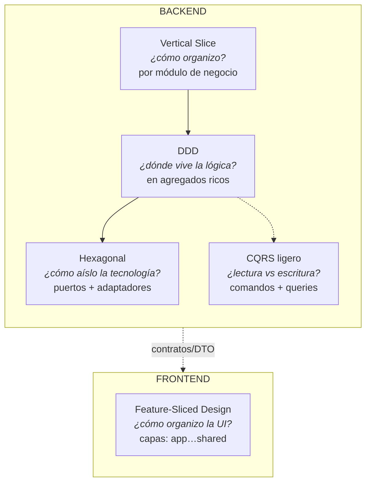

**La regla que lo une todo (regla hexagonal):**

> **Si borras toda la carpeta `infrastructure/` de un módulo, su `domain/` debe seguir
> compilando.** Si no compila, existe una dependencia prohibida (dominio → infraestructura).

Todo apunta hacia el dominio. El dominio no apunta a nadie.

---

# PARTE II — PRINCIPIOS RECTORES

Ocho principios gobiernan cada decisión. Están ordenados: cuando dos entran en
conflicto, gana el de número menor.

1. **Regla de dependencia (Dependency Rule).** El código fuente de una capa interna
   nunca conoce nombres de una capa externa. El dominio no importa framework, ORM,
   HTTP ni SDKs. Las dependencias apuntan hacia adentro.

2. **El dominio es puro.** El núcleo (entidades, value objects, servicios de dominio,
   eventos, puertos) no importa nada de infraestructura. Es TypeScript/lenguaje plano,
   testeable sin base de datos, sin red y sin framework.

3. **La lógica de negocio vive en el agregado, no en el servicio ni en el repositorio.**
   El servicio *orquesta*; el repositorio *persiste*; el agregado *decide*. Un servicio
   que decide reglas y un agregado sin métodos (solo getters/setters) es el
   anti-patrón "modelo anémico".

4. **Un puerto por necesidad, N adaptadores intercambiables.** El dominio define *qué*
   necesita (una interfaz); la infraestructura provee *quién* lo cumple (implementaciones).
   Cambiar de proveedor = escribir un adaptador nuevo, sin tocar el dominio.

5. **YAGNI de estructura.** La estructura sigue al código, no lo precede. Las carpetas
   nacen cuando el volumen las exige, no "por si acaso". Una carpeta con un solo archivo
   dentro huele a prematura.

6. **No aceptar patrones por autoridad.** Que un patrón venga de una empresa grande o
   de un libro famoso no lo hace correcto *para este sistema*. Se evalúa por el valor
   que aporta en el contexto actual. Se critica toda propuesta antes de adoptarla.

7. **Una sola estrategia de error.** No se mezclan dos estilos de manejo de error. Se
   elige uno (excepciones de dominio *o* tipos Result/Either) y se usa en todo el
   sistema. Mezclarlos es peor que cualquiera de los dos.

8. **La documentación es parte de la entrega.** Todo cambio que altere estructura,
   contratos o decisiones actualiza el documento canónico correspondiente. Un mapa
   claro sobre un estado honesto le gana a un estado "perfecto" sin mapa.

---

# PARTE III — DIAGRAMA DE ARQUITECTURA

## III.A — Vista hexagonal (el dominio en el centro)

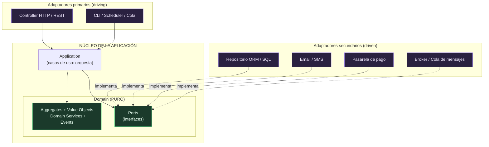

Lectura: **los adaptadores apuntan al dominio; el dominio no apunta a nadie.** Los
adaptadores primarios *invocan* el núcleo; los secundarios *implementan* sus puertos.

## III.B — Vista por capas (dirección de dependencia)

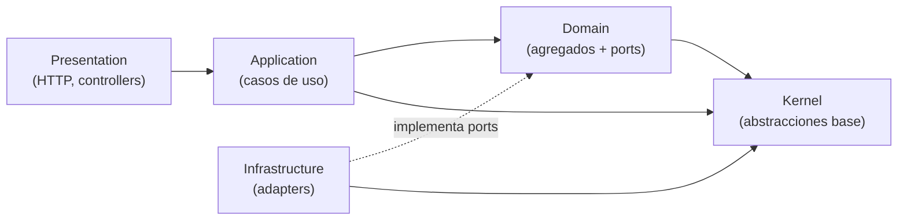

Prueba mental infalible: **borra `Infrastructure` → `Domain` sigue compilando.**

## III.C — Composición de módulos (Vertical Slice)

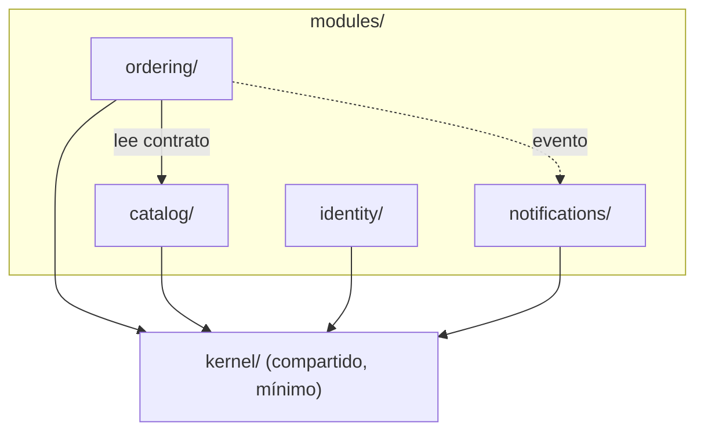

Cada módulo es un mini-sistema autónomo con sus propias capas internas.

---

# PARTE IV — VERTICAL SLICE: ANATOMÍA DE UN MÓDULO

En lugar de organizar el backend por **capa técnica global** (`/controllers`,
`/services`, `/repositories`), se organiza por **capacidad de negocio**: cada módulo
es un *bounded context* y contiene sus propias capas.

```
modules/
└── <context>/                       # p. ej. ordering, catalog, identity
    ├── contracts/                   # DTOs públicos (request/response) — el borde HTTP
    ├── domain/                      # NÚCLEO puro (sin framework, sin ORM)
    │   ├── entities/                #   agregados y entidades
    │   ├── value-objects/           #   ⌁ nace con la 1ª VO
    │   ├── services/                #   ⌁ lógica que cruza dos agregados
    │   ├── events/                  #   domain events
    │   └── ports/                   #   interfaces (contratos de infraestructura)
    ├── application/                 # casos de uso (orquestan) — PLANO al inicio
    │   └── (⌁ commands/ + queries/  →  se separan a ~20 casos)
    ├── infrastructure/              # ADAPTADORES (implementan los ports)
    │   ├── persistence/             #   repositorio ORM + mapper (dominio ⇄ ORM)
    │   ├── external/                #   ⌁ SDKs de terceros (pago, email, cloud)
    │   ├── messaging/               #   ⌁ nace con el 1er broker real
    │   └── cache/                   #   ⌁ nace con el 1er cache real
    ├── presentation/                # controllers + wiring del framework (HTTP)
    └── tests/                       # unit (dominio) + integration (adapter)
```

> `⌁` = **no existe hasta que el volumen lo exige** (ver PARTE XI, YAGNI de estructura).

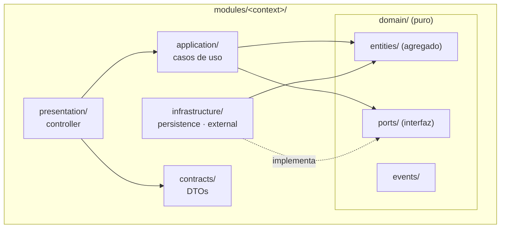

**Por qué Vertical Slice.** Trabajar en una capacidad = abrir **una** carpeta, no saltar
entre cuatro. Un módulo autónomo se extrae a un microservicio moviendo su carpeta.
Reduce la carga cognitiva: la frontera del módulo es la frontera del significado.

---

# PARTE V — DDD: BLOQUES DE CONSTRUCCIÓN (CON EJEMPLOS)

DDD modela el software con el **lenguaje y las reglas del negocio**, no con las tablas
de la base de datos. Estos son los bloques, del más al menos fundamental.

## V.1 — Entity (entidad)

Objeto con **identidad** y ciclo de vida. Dos entidades son iguales si comparten `id`,
aunque sus demás campos difieran.

```ts
export abstract class Entity<TId> {
  protected constructor(public readonly id: TId) {}
  equals(other?: Entity<TId>): boolean {
    return !!other && this.id === other.id;
  }
}
```

## V.2 — Aggregate Root (raíz de agregado)

Una entidad que **protege invariantes** y es la única puerta de entrada a un grupo de
objetos que deben mantenerse consistentes juntos. Acumula **domain events**.

```ts
export abstract class AggregateRoot<TId> extends Entity<TId> {
  private _events: DomainEvent[] = [];
  protected record(event: DomainEvent): void {
    this._events.push(event);
  }
  pullEvents(): DomainEvent[] {
    const events = this._events;
    this._events = [];
    return events;
  }
}
```

**Regla de oro del agregado:** *una transacción modifica un solo agregado.* Los cambios
que cruzan agregados se coordinan con **domain events**, nunca con un mega-agregado.

Ejemplo canónico — un agregado con una máquina de estados. La **decisión** vive aquí;
el *cómo* se persiste vive en el adaptador:

```ts
export enum OrderStatus {
  PENDING = 'pending',
  CONFIRMED = 'confirmed',
  SHIPPED = 'shipped',
  DELIVERED = 'delivered',
  CANCELLED = 'cancelled',
}

const ALLOWED: Record<OrderStatus, OrderStatus[]> = {
  [OrderStatus.PENDING]:   [OrderStatus.CONFIRMED, OrderStatus.CANCELLED],
  [OrderStatus.CONFIRMED]: [OrderStatus.SHIPPED, OrderStatus.CANCELLED],
  [OrderStatus.SHIPPED]:   [OrderStatus.DELIVERED],
  [OrderStatus.DELIVERED]: [],
  [OrderStatus.CANCELLED]: [],
};

export class Order extends AggregateRoot<string> {
  private constructor(id: string, private _status: OrderStatus) {
    super(id);
  }

  static rehydrate(id: string, status: OrderStatus): Order {
    return new Order(id, status); // reconstrucción desde persistencia (sin eventos)
  }

  get status(): OrderStatus {
    return this._status;
  }

  /** La REGLA vive aquí: solo transiciones válidas; idempotente. */
  transitionTo(target: OrderStatus): void {
    if (this._status === target) return;                 // idempotente
    if (!ALLOWED[this._status].includes(target)) {
      throw new DomainError(`Transición inválida: ${this._status} → ${target}`);
    }
    this._status = target;
    this.record(new OrderStatusChanged(this.id, target));
  }
}
```

## V.3 — Value Object (objeto de valor)

Se define por su **valor**, es **inmutable**, y **valida su formato en el constructor**.
Dos value objects con el mismo valor son intercambiables (no tienen identidad).

```ts
export class Money {
  private constructor(public readonly cents: number) {}
  static of(amount: number): Money {
    if (!Number.isFinite(amount) || amount < 0) {
      throw new DomainError('El monto debe ser un número ≥ 0');
    }
    return new Money(Math.round(amount * 100));
  }
  add(other: Money): Money {
    return new Money(this.cents + other.cents);
  }
  toNumber(): number {
    return this.cents / 100;
  }
}
```

Señal para extraer un VO: **estás validando el mismo formato en tres lugares.**

## V.4 — Factory (fábrica)

Encapsula las **reglas de creación** de un agregado (validaciones, cálculos, defaults).
Cuando el id lo asigna la persistencia, la factory devuelve un **plan/borrador** de datos
validados que el adaptador persiste.

```ts
export interface PlaceOrderInput {
  readonly lines: ReadonlyArray<{ productId: string; quantity: number; unitPrice: number }>;
}
export interface OrderPlan {
  readonly status: OrderStatus;
  readonly total: number;
  readonly lines: ReadonlyArray<{ productId: string; quantity: number; subtotal: number }>;
}

export class OrderFactory {
  /** Toda la REGLA de creación es dominio puro y testeable sin BD. */
  static place(input: PlaceOrderInput): OrderPlan {
    if (input.lines.length === 0) {
      throw new DomainError('Un pedido requiere al menos una línea');
    }
    let total = 0;
    const lines = input.lines.map((l) => {
      const subtotal = Math.round(l.unitPrice * l.quantity * 100) / 100;
      total += subtotal;
      return { productId: l.productId, quantity: l.quantity, subtotal };
    });
    return { status: OrderStatus.PENDING, total: Math.round(total * 100) / 100, lines };
  }
}
```

## V.5 — Domain Service (servicio de dominio)

Lógica de negocio que **no pertenece naturalmente a un solo agregado** (cruza dos) y que
**no es orquestación** (eso es un caso de uso). Es la excepción, no la regla: primero
intenta poner la lógica dentro del agregado.

## V.6 — Domain Event (evento de dominio)

Representa "algo que ya pasó" que le importa a **otro** módulo o handler. Nombre en
pasado. Se usa para reaccionar y para **romper ciclos de dependencia**.

```ts
export abstract class DomainEvent {
  readonly occurredOn: Date;
  protected constructor(occurredOn: Date = new Date()) {
    this.occurredOn = occurredOn;
  }
}

export class OrderStatusChanged extends DomainEvent {
  constructor(public readonly orderId: string, public readonly status: OrderStatus) {
    super();
  }
}
```

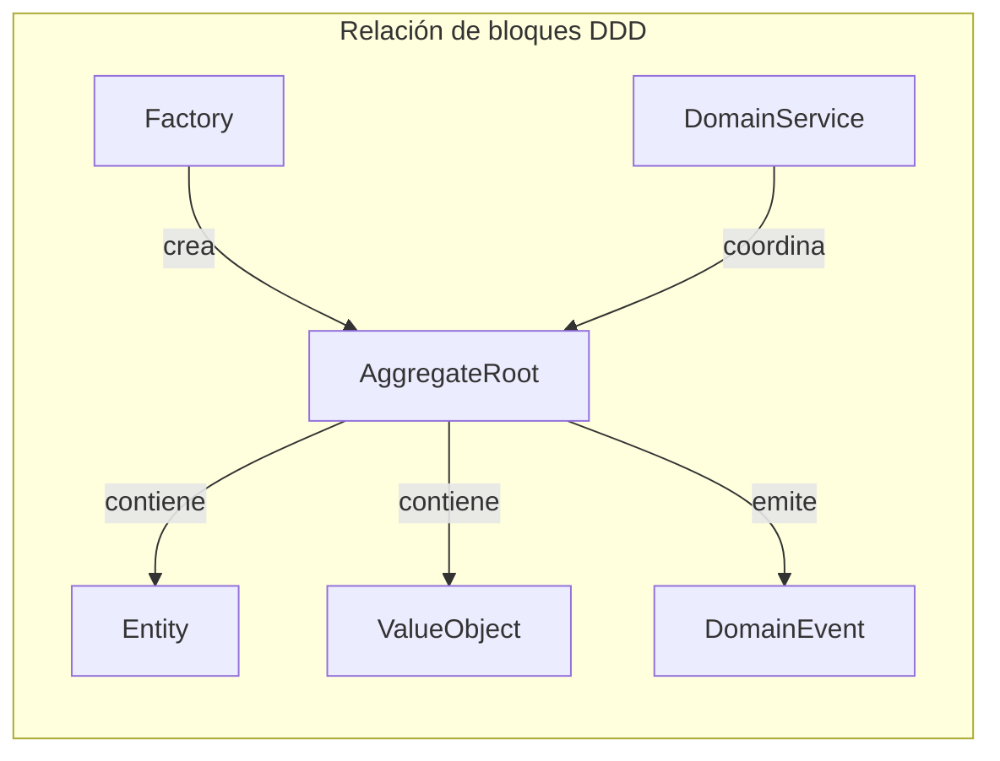

---

# PARTE VI — HEXAGONAL: PUERTOS Y ADAPTADORES

## VI.1 — El puerto (Port)

Una **interfaz** definida por el dominio que expresa *qué* necesita de la infraestructura,
sin decir *cómo*. Vive en `domain/ports/`. **Habla en tipos de dominio o de contrato,
nunca en tipos de infraestructura** (no ORM entities, no objetos del framework de auth).

```ts
// domain/ports/order.repository.ts
export interface OrderRepository {
  findById(id: string): Promise<Order | null>;
  save(order: Order): Promise<void>;
}
export const ORDER_REPOSITORY = Symbol('OrderRepository');
```

## VI.2 — El adaptador (Adapter)

La **implementación concreta** de un puerto. Vive en `infrastructure/`. Es el único
lugar que conoce la tecnología concreta (ORM, SDK). Traduce en el borde con un **mapper**.

```ts
// infrastructure/persistence/typeorm-order.repository.ts
@Injectable()
export class TypeOrmOrderRepository implements OrderRepository {
  constructor(private readonly repo: Repository<OrderEntity>) {}

  async findById(id: string): Promise<Order | null> {
    const row = await this.repo.findOne({ where: { id } });
    return row ? OrderMapper.toDomain(row) : null; // mapper: ORM → dominio
  }

  async save(order: Order): Promise<void> {
    const row = OrderMapper.toEntity(order);          // mapper: dominio → ORM
    await this.repo.save(row);
  }
}
```

## VI.3 — El mapper (traductor de frontera)

El **único** punto que conoce ambos mundos (dominio y ORM). Aísla el resto del sistema
del formato de persistencia.

```ts
export class OrderMapper {
  static toDomain(row: OrderEntity): Order {
    return Order.rehydrate(row.id, row.status as OrderStatus);
  }
  static toEntity(order: Order): OrderEntity {
    const e = new OrderEntity();
    e.id = order.id;
    e.status = order.status;
    return e;
  }
}
```

## VI.4 — Intercambiabilidad (el beneficio real)

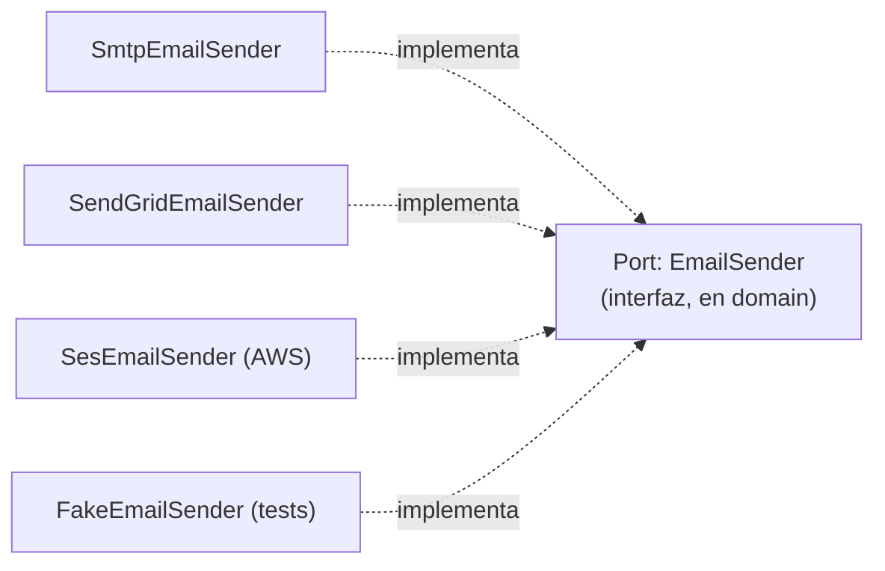

Cambiar de proveedor de correo = escribir un adaptador nuevo y cambiar **una línea** de
wiring. El dominio y los casos de uso no se enteran. Los tests usan un adaptador falso.

---

# PARTE VII — KERNEL · CQRS LIGERO · ESTRATEGIA DE ERROR

## VII.1 — Kernel minimalista

Las abstracciones **base** que todos los módulos comparten: `Entity`, `AggregateRoot`,
`ValueObject`, `DomainEvent`, `DomainError`, `UseCase`. **Cero reglas de negocio, cero
puertos concretos.** El kernel no conoce a ningún módulo.

```
kernel/
└── domain/
    ├── Entity.ts
    ├── AggregateRoot.ts
    ├── ValueObject.ts
    ├── DomainEvent.ts
    ├── DomainError.ts
    └── UseCase.ts
```

**Regla:** si te tienta poner `IEmailSender` o un helper de un módulo en el kernel, **no**.
Los puertos viven en `modules/<x>/domain/ports/`; los helpers, en su módulo.

## VII.2 — CQRS ligero

Separar **comandos** (mutan estado) de **queries** (leen), pero **sin infraestructura de
mediador**. Es organización, no maquinaria.

```ts
export interface UseCase<TInput, TOutput> {
  execute(input: TInput): Promise<TOutput>;
}

export class ConfirmOrder implements UseCase<{ orderId: string }, void> {
  constructor(private readonly orders: OrderRepository) {}
  async execute({ orderId }: { orderId: string }): Promise<void> {
    const order = await this.orders.findById(orderId);
    if (!order) throw new NotFoundError('Pedido no encontrado');
    order.transitionTo(OrderStatus.CONFIRMED); // el agregado decide
    await this.orders.save(order);
  }
}
```

**No** hay `CommandBus`/`QueryBus`/`Mediator` hasta que el volumen lo justifique
(típicamente >20 casos de uso o necesidad transversal de logging/retry). Las carpetas
`commands/` y `queries/` aparecen por umbral (PARTE XI).

## VII.3 — Estrategia de error única

Se elige **un** estilo. Recomendación por defecto: **excepciones de dominio**
(`DomainError`), porque la mayoría de frameworks ya lanzan excepciones y mezclar con
`Result`/`Either` produce dos flujos de error simultáneos.

```ts
export class DomainError extends Error {
  constructor(message: string) {
    super(message);
    this.name = new.target.name; // el subtipo da el nombre
  }
}
export class NotFoundError extends DomainError {}
```

El dominio lanza `DomainError`; la **presentación** mapea cada subtipo a su código HTTP.
Los value objects validan en su constructor y lanzan `DomainError`. **No** se usa
`Result`/`Either` (a menos que un flujo concreto lo justifique y se documente).

---

# PARTE VIII — REGLAS DE DEPENDENCIA

## VIII.A — Nivel de capa (dentro de un módulo)

```
Presentation  ──→  Application  ──→  Domain  ──→  (Ports)
                                                     ▲
Infrastructure ─────────────────────────────────────┘
```

**Permitido ✅ / Prohibido ✗:**

```
✅ Presentation   → Application            (el controller invoca el caso de uso)
✅ Application    → Domain / Domain Ports  (orquesta; depende de la INTERFAZ)
✅ Infrastructure → Domain Ports           (el adaptador IMPLEMENTA la interfaz)
✅ Infrastructure → Domain (tipos)         (el mapper conoce el agregado)
✅ cualquier capa → kernel/domain          (Entity, DomainError, ValueObject…)

✗ Domain          → Infrastructure         (el dominio NO conoce ORM/HTTP/SDK)
✗ Domain          → Application / Presentation
✗ Application     → Presentation
✗ Application     → Infrastructure concreta (depende del PORT, no del adaptador)
✗ kernel          → cualquier módulo / infraestructura
```

Prueba mnemónica: **borra `infrastructure/` → `domain/` compila.**

## VIII.B — Nivel de módulo

```
✅ moduloA → moduloB     (lectura, vía el contrato público de B, en una sola dirección)
✅ moduloA ▷ moduloC     (reacción, vía domain event; A no conoce a C)
✅ (todos) ← identity    (cross-cutting: auth entra por guard/token, no por import de módulo)

✗ import del domain/ interno de otro módulo
✗ dependencias circulares entre módulos
✗ shared/ conteniendo lógica de negocio
```

## VIII.C — Cómo romper un ciclo

Si B debe reaccionar a A, pero A → B ya existe:

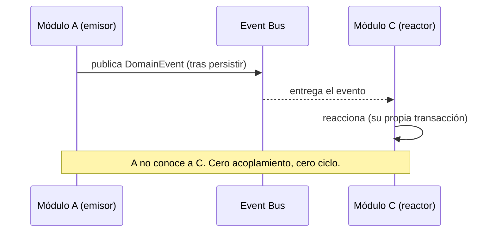

---

# PARTE IX — BOUNDED CONTEXT MAP + CONTEXT MAP

Un **bounded context** es una frontera de significado: un término significa una cosa
precisa dentro de él y puede significar otra fuera. Cada módulo es un bounded context.

## IX.A — Requisitos para que exista un contexto nuevo

Un contexto nuevo (no un feature dentro de uno existente) se justifica **solo si**:

1. Tiene **lenguaje ubicuo propio** (términos con significado distinto a otros contextos).
2. Tiene **su propia razón de cambiar** (regla del cambio único).
3. Es **extraíble a un servicio** sin arrastrar otro contexto.

Si falla alguno → es un feature dentro de un contexto existente, no un contexto.

## IX.B — Context Map (quién habla con quién)

El mapa define las **direcciones permitidas** de comunicación. El sentido importa:
evita ciclos.

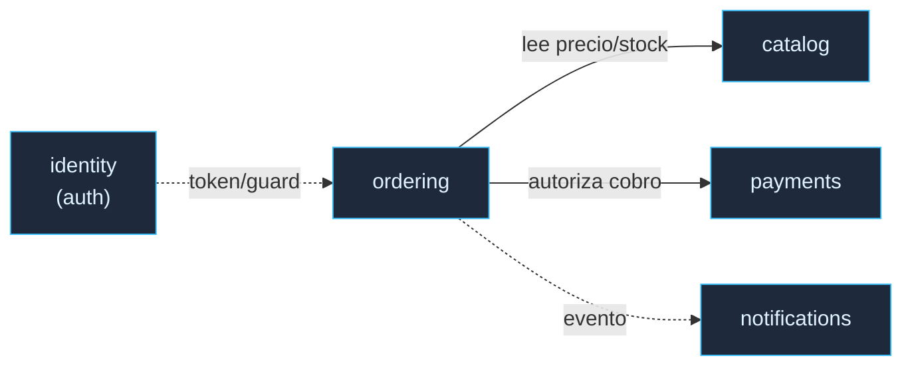

Convención: `──→` llamada directa (lectura del contrato del destino) · `-.->` reacción
por evento (desacoplada).

**Prohibiciones que evitan ciclos:**
```
catalog / payments / notifications  ✗ NUNCA llaman a ordering
notifications                       ✗ solo reacciona a eventos; no llama de vuelta
cualquier módulo                    ✗ nunca importa identity como módulo (entra por token)
kernel                              ✗ nunca depende de un módulo
```

---

# PARTE X — DECISION MATRIX: CUÁNDO CREAR CADA PIEZA

Antes de crear una pieza, pasa por su fila. Si no cumples el "CREA si", **no la crees**.

| Pieza | CREA si… | NO si… |
|-------|----------|--------|
| **Aggregate** | tiene identidad + ciclo de vida y protege invariantes que van SIEMPRE juntas (frontera de consistencia) | es solo datos sin reglas → Value Object o read-model |
| **Value Object** | se define por su valor, inmutable, encapsula una regla de formato | necesita identidad o cambia en el tiempo → Entity |
| **Domain Service** | la lógica cruza dos agregados y no es orquestación | cabe en un agregado (ponla ahí) o es IO/coordinación (es un caso de uso) |
| **Domain Event** | "algo pasó" que a OTRO le importa, o para romper un ciclo | nadie reacciona todavía → YAGNI |
| **Módulo (contexto)** | cumple los 3 requisitos de IX.A | falla alguno → feature dentro de un módulo existente |
| **Port** | necesitas hablar con algo externo detrás de una interfaz de dominio | no hay dependencia externa → no lo abstraigas |
| **Adapter** | hay un port ya definido que implementar | no existe el port aún → defínelo primero |
| **Contract/DTO** | un dato cruza el borde del módulo (request/response) | es un tipo interno → no lo publiques |

Regla del agregado: **una transacción = un agregado.** Cambios cruzados → Domain Event.
Evita el "servicio anémico" que se traga toda la lógica y deja agregados vacíos.

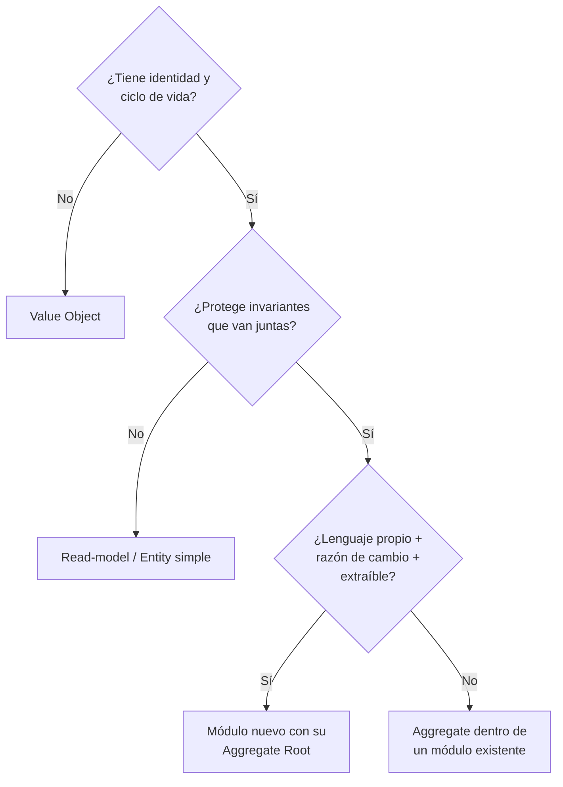

---

# PARTE XI — YAGNI DE ESTRUCTURA (UMBRALES)

La estructura sigue al código. Umbrales concretos para *cuándo* subdividir:

| Carpeta | Arranca como… | Se subdivide cuando… |
|---------|---------------|----------------------|
| `application/` | archivos planos (`confirm-order.ts`, `get-order.ts`) | ~20 casos de uso → `commands/` + `queries/` |
| `infrastructure/` | solo `persistence/` + `external/` | aparece el 1er broker/cache real → `messaging/`, `cache/` |
| `presentation/` | archivos planos (un controller, un guard) | hay VARIOS de un tipo → `controllers/`, `guards/`, `pipes/` |
| `tests/` | `unit/` + `integration/` | aparece la necesidad → `contract/`, `fixtures/`, `builders/` |
| `contracts/` | dentro del módulo | se genera SDK/OpenAPI público → se promueve a un paquete de contratos |
| `domain/` | `entities/` + `ports/` | aparece la 1ª VO → `value-objects/`; el 1er servicio → `services/` |

**Ejemplo antes/después (`application/`):**

```
# HOY (pocos casos)                    # DESPUÉS (~20 casos)
application/                           application/
├── confirm-order.ts                   ├── commands/
├── cancel-order.ts                    │   ├── confirm-order.ts
└── get-order.ts                       │   └── cancel-order.ts
                                       └── queries/
                                           └── get-order.ts
```

**Regla dura:** *carpeta con un solo archivo dentro = huele a prematura → colapsar a
archivo plano.*

---

# PARTE XII — FLUJO COMPLETO DE UN REQUEST

## XII.A — Flujo de un comando (escritura)

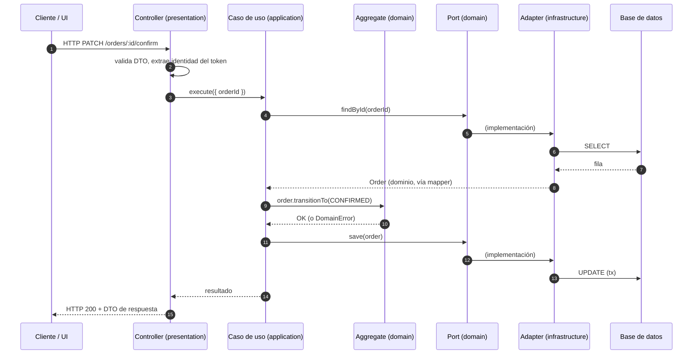

Regla de lectura: **el controller recibe · el caso de uso orquesta · el agregado decide ·
el adaptador ejecuta · el mapper traduce.**

## XII.B — Concurrencia (cuando aplica)

Cuando varias operaciones pueden mutar el mismo agregado en paralelo, la **mecánica** de
concurrencia (lock pesimista, transacción, revalidación sobre estado fresco) vive en el
**adaptador**; la **decisión** de si la operación es válida vive en el **agregado**. El
adaptador carga la fila bajo lock, mapea a dominio, pide al agregado que decida sobre ese
estado fresco, y persiste. Así el TOCTOU se cierra sin lógica de negocio en la infra.

---

# PARTE XIII — FRONTEND: FEATURE-SLICED DESIGN (FSD)

FSD organiza la UI en **capas horizontales** con una regla de dependencia estricta: una
capa solo puede importar de las capas **por debajo** de ella.

## XIII.A — Las capas (de arriba hacia abajo)

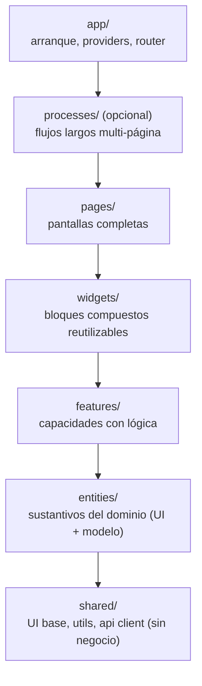

Regla de dependencia FSD: **una capa importa solo de capas inferiores.** `features` puede
usar `entities` y `shared`, pero `entities` **no** puede importar `features`.

| Capa | Responsabilidad | Ejemplo |
|------|-----------------|---------|
| `app` | composición raíz: providers, router, theme | `AppRouter`, `StoreProvider` |
| `processes` | flujo largo con estado propio que cruza features (opcional) | `Checkout`, `Onboarding` |
| `pages` | una pantalla completa, ensambla widgets/features | `OrderDetailPage` |
| `widgets` | bloque de UI compuesto y reutilizable | `Header`, `OrderCard` |
| `features` | una capacidad con lógica (una acción del usuario) | `add-to-cart`, `filter-catalog` |
| `entities` | el "sustantivo": tipo + UI atómica + acceso a datos | `order/`, `product/` |
| `shared` | UI base, hooks, utils, cliente HTTP — **sin** lógica de negocio | `Button`, `apiClient` |

## XIII.B — Cómo clasificar un componente

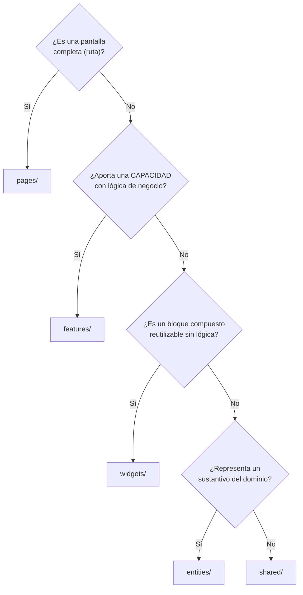

## XIII.C — `processes/` vs no crearlo

`processes/` es **opcional**: solo para flujos largos, multi-página, con estado propio
(checkout, onboarding, wizard). **No** se crea una capa `flows/` adicional en paralelo a
`processes/` — duplica responsabilidades. Si un flujo cabe en una `page` o una `feature`,
va ahí (regla 5, YAGNI).

---

# PARTE XIV — TESTING, CONVENCIONES Y ANTI-PATRONES

## XIV.A — Estrategia de testing

| Nivel | Qué prueba | Cómo | Velocidad |
|-------|-----------|------|-----------|
| **Unit (dominio)** | invariantes del agregado, VOs, factories, servicios de dominio | sin BD, sin framework — objetos planos | milisegundos |
| **Integration (adapter)** | que el adaptador cumple el puerto contra tecnología real | BD/servicio real o doble fiel | segundos |
| **Contract** | que el request/response del borde no cambia | golden tests sobre el DTO | rápida |
| **E2E (opcional)** | un flujo completo de punta a punta | driver real | lenta |

Principio: **el dominio se prueba unitariamente** (rápido, sin infraestructura) y ahí
vive la mayor densidad de tests. La infraestructura se prueba por integración.

## XIV.B — Convenciones

- **Naming.** Agregados y VOs en PascalCase por concepto de negocio (`Order`, `Money`).
  Puertos como interfaces con nombre de rol (`OrderRepository`, `EmailSender`).
  Casos de uso como verbo-objeto (`ConfirmOrder`, `GetOrder`).
- **Imports.** El dominio nunca importa de `infrastructure/`, `presentation/`, ni del
  framework. Prohibido el import circular entre módulos.
- **Ubicación.** Antes de escribir código, decide en qué capa vive y busca si ya existe.
  Código duplicado = bloqueado hasta encontrar la ubicación correcta.
- **Un archivo, una responsabilidad.** Un agregado por archivo; un puerto por archivo.

## XIV.C — Anti-patrones (qué NO hacer)

```
❌ Modelo anémico: agregados con solo getters/setters y lógica en el servicio.
   → La regla va en el agregado.
❌ El dominio importando ORM, framework HTTP o SDKs.
   → Prueba: "borra infrastructure/ → domain compila".
❌ Puertos que devuelven entidades del ORM o tipos del framework de auth.
   → El puerto habla en tipos de dominio o de contrato.
❌ Ports o helpers de negocio en el kernel.
   → El kernel es solo abstracciones base; los ports viven en el módulo.
❌ Un shared/ que crece con helpers/utils/constants de negocio.
   → Lo de un módulo va al módulo; el kernel guarda solo lo base.
❌ CommandBus/Mediator/Result+excepciones antes de necesitarlo.
   → CQRS ligero + una sola estrategia de error.
❌ Subdividir carpetas "por si acaso" (infra/presentation/tests con un archivo).
   → YAGNI: la estructura nace por umbral.
❌ Big-bang de migración: reescribir todo de golpe sin compilar.
   → Migración incremental; el repo siempre compila y los tests verdes.
❌ Adoptar un patrón "porque lo usa una empresa grande".
   → Se evalúa por el valor en el contexto actual.
```

---

# PARTE XV — GLOSARIO

- **Aggregate / Agregado.** Objeto con identidad que protege invariantes y es la única
  puerta a un grupo consistente de objetos. Dueño de las reglas de negocio.
- **Aggregate Root.** La entidad que representa y controla el agregado desde afuera.
- **Value Object.** Objeto inmutable definido por su valor, que valida su formato.
- **Domain Service.** Lógica de negocio que cruza dos agregados y no es orquestación.
- **Domain Event.** Hecho consumado del dominio, usado para reaccionar y romper ciclos.
- **Factory.** Encapsula las reglas de creación de un agregado.
- **Port / Puerto.** Interfaz del dominio que declara *qué* necesita de la infraestructura.
- **Adapter / Adaptador.** Implementación concreta de un puerto; conoce la tecnología.
- **Mapper.** Traductor de frontera entre el dominio y el formato de persistencia.
- **Use Case / Caso de uso.** Orquestador de aplicación: carga, invoca al dominio, persiste.
- **CQRS.** Separación de comandos (escriben) y queries (leen).
- **Bounded Context.** Frontera de significado; un módulo.
- **Context Map.** Grafo de qué contexto puede comunicarse con cuál y en qué dirección.
- **Kernel.** Abstracciones de dominio base compartidas por todos los módulos.
- **Vertical Slice.** Organización del código por capacidad de negocio, no por capa técnica.
- **FSD.** Feature-Sliced Design: organización del frontend en capas con regla de dependencia.
- **Dependency Rule.** Las dependencias apuntan hacia adentro; el dominio no conoce lo externo.
- **Anemic Model / Modelo anémico.** Anti-patrón: datos sin comportamiento; lógica fuera del objeto.

---

# ANEXO A — EJEMPLO DE INSTANCIACIÓN REAL (el árbol final)

Esta guía es abstracta; este anexo la aterriza en **un árbol real** para mostrar cómo
se ve cuando se aplica. Léelo como *"así queda el sistema"*, no como parte normativa.

**Lectura honesta del estado.** El árbol es un **híbrido intencional**:
- **`modules/orders/`** es el **vertical slice de referencia** — completo y hexagonal-puro
  (contracts · domain{entities,events,ports} · application · infrastructure/persistence ·
  presentation · tests). Es el molde que cualquier contexto con lógica rica debe copiar.
- **`modules/products/`** es un **módulo fino**: solo extrae al dominio su invariante
  (`product.policy.ts`), porque es casi CRUD (Decision Matrix, PARTE X + YAGNI, PARTE XI).
- **`application/` · `domain/` · `infrastructure/` · `presentation/` (raíz)** son las
  **capas clásicas** donde aún viven contextos CRUD/cross-cutting (`auth`, `settings`,
  perfiles) que **no ameritan** el molde completo (regla 6, no ceremonia sin valor).
- **`kernel/domain/`** son las abstracciones base (PARTE VII), sin negocio.
- **`frontend/src/`** aplica **FSD** (PARTE XIII): `app · entities · features · pages ·
  shared · widgets`.

## Mapa: rama del árbol → Parte de esta guía

| Rama | Concepto | Parte |
|------|----------|-------|
| `kernel/domain/` | Kernel minimalista | VII |
| `modules/orders/` | Vertical Slice completo | IV |
| `modules/orders/contracts/` | DTOs del borde | IV, VI |
| `modules/orders/domain/{entities,events,ports}/` | DDD + puertos | V, VI |
| `modules/orders/application/` | Casos de uso (CQRS ligero) | VII |
| `modules/orders/infrastructure/persistence/` | Adapter + mapper | VI |
| `modules/orders/presentation/` | Controller + wiring | XII |
| `modules/products/domain/product.policy.ts` | Módulo fino (invariante) | X, XI |
| `application/·domain/·infrastructure/·presentation/` (raíz) | Capas legacy / CRUD | XI, XIV |
| `docs/arquitectura/{bounded-contexts,dependency-rules,decision-matrix,decisiones}.md` | Gobernanza viva | VIII, IX, X |
| `frontend/src/{app,entities,features,pages,shared,widgets}/` | FSD | XIII |

## El árbol

```
PROYECTO XXX/
├── .githooks/
│   └── pre-commit
└── -Proyecto/
    ├── .claude/                                  # docs para agentes de IA
    │   ├── Architecture.md
    │   └── REFACTORING_PLAN_DDD.md
    ├── backend/
    │   └── src/
    │       ├── kernel/                           # ← PARTE VII: abstracciones base (sin negocio)
    │       │   └── domain/
    │       │       ├── AggregateRoot.ts
    │       │       ├── DomainError.ts
    │       │       ├── DomainEvent.ts
    │       │       ├── Entity.ts
    │       │       └── UseCase.ts
    │       │
    │       ├── modules/                          # ← PARTE IV: Vertical Slice
    │       │   ├── orders/                       #   MÓDULO DE REFERENCIA (completo, hexagonal-puro)
    │       │   │   ├── contracts/                #     DTOs del borde HTTP
    │       │   │   │   ├── create-order.dto.ts
    │       │   │   │   ├── update-order-status.dto.ts
    │       │   │   │   ├── order-response.ts
    │       │   │   │   └── order-metrics.ts
    │       │   │   ├── domain/                   #     NÚCLEO puro (PARTE V, VI)
    │       │   │   │   ├── entities/Order.ts     #       agregado: reglas + factory
    │       │   │   │   ├── events/OrderCancelled.ts
    │       │   │   │   └── ports/order.repository.port.ts
    │       │   │   ├── application/              #     casos de uso (PARTE VII)
    │       │   │   │   ├── orders.service.ts
    │       │   │   │   ├── orders.service.spec.ts
    │       │   │   │   └── order-expiry.scheduler.ts
    │       │   │   ├── infrastructure/           #     ADAPTADORES (PARTE VI)
    │       │   │   │   └── persistence/
    │       │   │   │       ├── order.repository.ts   # adapter (implementa el port)
    │       │   │   │       └── order.mapper.ts       # traductor dominio ⇄ ORM
    │       │   │   ├── presentation/             #     HTTP (PARTE XII)
    │       │   │   │   ├── orders.controller.ts
    │       │   │   │   ├── orders.controller.spec.ts
    │       │   │   │   └── orders.module.ts
    │       │   │   └── tests/unit/               #     unit del dominio (PARTE XIV)
    │       │   │       ├── order.spec.ts
    │       │   │       └── order-place.spec.ts
    │       │   ├── products/                     #   MÓDULO FINO (solo dominio; casi CRUD)
    │       │   │   ├── domain/product.policy.ts  #     invariante extraída (PARTE X/XI)
    │       │   │   └── tests/unit/product.policy.spec.ts
    │       │   └── README.md                     #   mapa de módulos (gobernanza viva)
    │       │
    │       ├── application/                      # ← capas CLÁSICAS: contextos aún NO migrados
    │       │   ├── auth/                         #     (cross-cutting) — servicio + DTOs
    │       │   ├── products/                     #     CRUD del catálogo
    │       │   ├── settings/                     #     CRUD de configuración
    │       │   └── payments/                     #     pasarela (servicio)
    │       ├── domain/                           #   interfaces de repo de los legacy
    │       │   ├── product/ · settings/ · user-profile/
    │       ├── infrastructure/                   # ← adaptadores compartidos + los legacy
    │       │   ├── auth/jwt.strategy.ts
    │       │   ├── database/                     #     entities · migrations · repositories · data-source
    │       │   ├── keycloak/keycloak-admin.service.ts
    │       │   └── logging/
    │       ├── presentation/                     # ← controllers de los contextos legacy
    │       │   ├── auth/     (decorators · guards · controllers · module)
    │       │   ├── health/
    │       │   ├── products/
    │       │   └── settings/
    │       ├── shared/                           # ← cross-cutting técnico (NO negocio)
    │       │   ├── logging/audit-log.service.ts
    │       │   └── resilience/circuit-breaker.ts
    │       ├── app.module.ts                     #   composición raíz (wiring)
    │       └── main.ts
    │
    ├── docs/
    │   ├── arquitectura/                         # ← GOBERNANZA VIVA (PARTES VIII/IX/X)
    │   │   ├── bounded-contexts.md               #     Context Map
    │   │   ├── dependency-rules.md               #     reglas de dependencia
    │   │   ├── decision-matrix.md                #     cuándo crear qué
    │   │   ├── decisiones.md                     #     ADRs
    │   │   └── architecture-propuesta.md
    │   ├── roadmap/
    │   │   ├── PROMPT_CONTEXTO_ARQUITECTURA.md   #     ESTE documento (la guía)
    │   │   ├── MASTER_PLAN_8WEEKS_HEXAGONAL.md
    │   │   └── README.md
    │   └── superpowers/priority/rules.md         #     reglas de proceso del equipo
    │
    ├── frontend/                                 # ← PARTE XIII: Feature-Sliced Design
    │   └── src/
    │       ├── app/                              #     arranque + navegación
    │       │   └── navigation/                   #       RootNavigator, stacks, tabs
    │       ├── pages/                            #     pantallas completas (admin, auth, cart, …)
    │       ├── widgets/                          #     bloques compuestos (AuthScaffold, BranchPicker)
    │       ├── features/                         #     capacidades con lógica (cart, catalog, auth, …)
    │       ├── entities/                         #     sustantivos de dominio (order, product, branch)
    │       └── shared/                           #     UI base · api client · theme · lib (sin negocio)
    │
    └── infra/                                    # ← despliegue local (fuera del código de app)
        ├── keycloak/   (realm + seed)
        ├── postgres/   (init + seed)
        └── docker-compose.yml
```

> Lo que este árbol demuestra: **una sola regla predecible** (abrir `modules/<x>/` = ver
> el contexto completo) conviviendo con capas clásicas para lo que **no** amerita el molde.
> Un híbrido **documentado** es más rastreable que un "todo perfecto" sin mapa (principio 8).

---

*Esta guía describe un estilo arquitectónico, no un producto. Cualquier ejemplo de código
es ilustrativo del patrón. La fuente de verdad de un sistema concreto es siempre su código;
esta guía explica cómo ese código debe estar organizado y por qué.*
